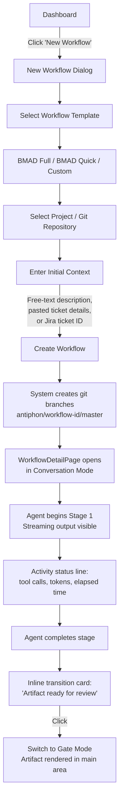
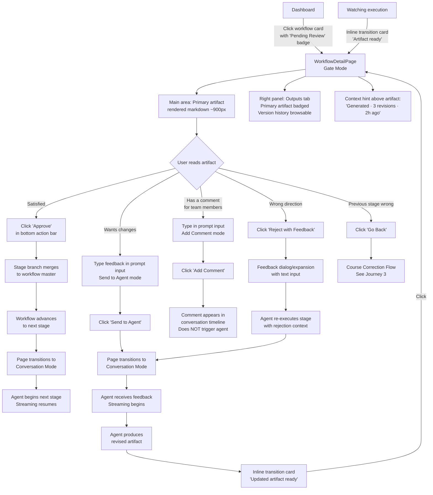
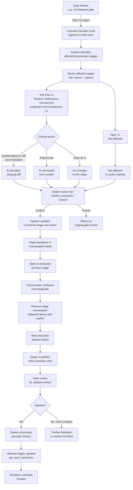
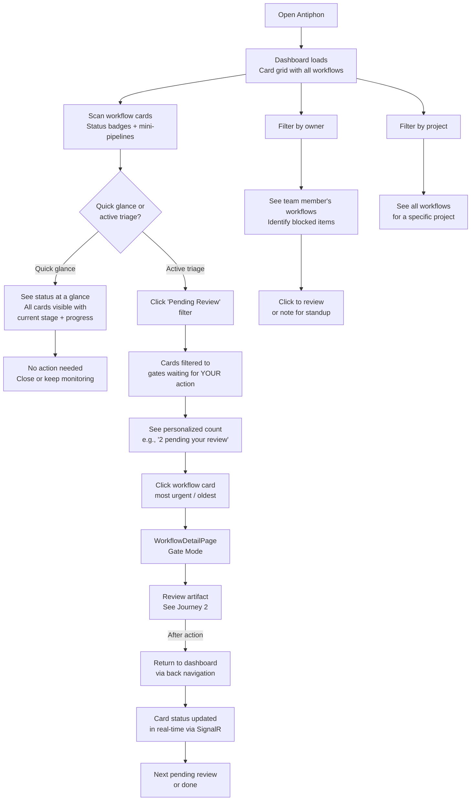

# UX Design Specification - Antiphon

**Author:** Mike
**Date:** 2026-03-15

---

## Executive Summary

### Project Vision

Antiphon is a spec-driven AI workflow orchestration platform that brings structure, visibility, and human governance to AI-assisted software development. Built as a React SPA (Bootstrap + Blueprint JS + react-icons) served by ASP.NET Core, it replaces ad-hoc AI coding sessions with structured, reviewable, version-controlled workflows. Single-tenant, self-hosted, desktop-only internal tool targeting developer teams.

The core UX thesis: AI does the work, humans steer through intelligent decision points. Neither operates in a vacuum.

### Target Users

- **Developers** — Primary users. Create workflows, watch AI agents execute in real-time, review generated artifacts (specs, architecture docs, test plans, code), provide feedback at approval gates, and iterate through course corrections. Tech-savvy, comfortable with git concepts, expect responsive tooling.
- **Team Leads** — Oversight users. Review pending approvals across the team, track workflow progress from the dashboard, drive adoption of spec-before-code culture. Need at-a-glance status without drilling into every workflow.
- **Admins** (post-MVP) — Platform engineers who deploy, configure LLM providers and model routing, manage projects, and set up integrations. Power users comfortable with YAML and infrastructure config.

### Key Design Challenges

1. **Information density vs. clarity** — Dashboard must surface workflow status, stage progression, pending approvals, and cost data without overwhelming. Progressive disclosure is critical.
2. **Real-time streaming UX** — Token-by-token agent output with activity status line must feel responsive and informative without being noisy. Users should always know what the agent is doing.
3. **Course correction flow complexity** — Diff-based cascade updates (update/regenerate/keep per affected stage) are the core differentiator but the most complex interaction. Must feel intuitive.
4. **Gate interaction model** — Approval gates are the primary human-AI collaboration point. Free-text prompting, approve/reject/go-back, and artifact review must feel conversational, not bureaucratic.

### Design Opportunities

1. **Progressive disclosure** — Workflow detail unfolds naturally: summary → stage view → artifact → diff → audit trail. Depth on demand.
2. **Live agent presence** — Real-time streaming + activity status line creates a compelling "AI working for you" experience that builds trust and differentiates from competitors.
3. **Git-backed versioning as UX feature** — Artifact version history and clean diff views make course correction feel powerful rather than complex.

## Core User Experience

### Defining Experience

Antiphon's core experience is a two-part loop:

1. **Dashboard triage** — Users scan their workflows (or the team's workflows) to identify what needs attention. Which workflows are blocked on me? Which stages just completed? What's the AI working on right now?
2. **Artifact review + action** — Users view the AI-generated output (rendered markdown), assess its quality, and take action: approve to advance, prompt the agent for changes, reject with feedback, or go back to a previous stage.

The dashboard also serves a **passive monitoring** mode — not every visit is action-driven. Sometimes users just want to glance: "is my thing still running?" "how far along is it?" The dashboard serves both glancing and deciding.

The dashboard answers "what needs me?" The gate interaction answers "what do I do about it?" Everything else in the product supports this loop.

### Platform Strategy

- **Desktop web only** — React SPA, modern evergreen browsers (Chrome, Edge, Firefox). No mobile, no offline, no SSR.
- **Mouse/keyboard primary** — Developer tooling; users expect keyboard shortcuts, text input, and precise interactions.
- **Always-connected** — Internal tool behind corporate network. SignalR for all real-time updates. No offline mode.
- **Single-tenant self-hosted** — One instance per org. No multi-tenant concerns, no public-facing pages, no SEO.
- **Component library discipline** — Bootstrap for layout, grid, and spacing utilities. Blueprint JS for complex interactive components (data tables, stage progression, artifact trees, diff panels, tabs). Do not mix visual languages — pick Bootstrap for structure, Blueprint for interaction. Consistent icon usage via react-icons.

### Effortless Interactions

- **Getting to what needs you** — Dashboard → pending item in 1-2 clicks. No hunting, no navigation maze. Role-based action surfacing: developers see their gates, team leads see team gates.
- **Understanding AI output** — Rendered markdown artifacts are immediately readable. Rich rendering: syntax highlighting for code blocks, Mermaid diagram support, clean typography. Content-first, minimal UI chrome. The artifact IS the page, not something embedded in a sidebar or modal.
- **Providing feedback** — Free-text prompt box feels like a chat message, not a form. Type, send, watch the agent respond. The feedback loop closes visibly — after sending, the user immediately sees the agent pick up the feedback and start working. No void.
- **Seeing agent activity** — Show the work at the right level. Dashboard shows summary status lines per workflow. Workflow detail page shows the full real-time stream with activity status line. No attempt to stream everything everywhere.
- **Knowing workflow status** — Progress indicators, stage state, and pending actions are visible at a glance on the dashboard. No drilling required to understand where things stand. Supports both quick glances and deep triage.

### Critical Success Moments

1. **"It's actually doing it"** — First time a user watches the agent stream output in real-time, sees tool calls happening, and realizes the AI is genuinely building their spec/architecture/code.
2. **"Course correction works"** — User rejects an artifact, types feedback, and gets a meaningfully better version back. The diff-based cascade updates downstream artifacts intelligently. This is the moment that proves the product's core thesis.
3. **"My team can see this"** — A developer has a reviewable artifact — a spec, architecture doc, or test plan — that their team can view, comment on, and approve before any code is written. The cultural shift from "surprise PR" to "reviewed spec" is the product's reason to exist.
4. **"I can see everything"** — Team lead opens the dashboard and knows exactly what's in flight, what's blocked, and what needs their review. No standup needed to get this picture.

### Experience Principles

1. **Show the work — at the right level** — AI execution is never a black box. But match the detail to the context: status lines on the dashboard, full streaming on the detail page. Transparency builds trust without overwhelming.
2. **Action over navigation** — Every screen makes the next action obvious. Pending approvals surface themselves. Role-aware: developers see their work, team leads see the team's work. The UI guides users toward what needs them.
3. **Content is king** — Artifacts (rendered markdown with syntax highlighting, diagrams, and clean typography) are the primary content. UI exists to frame and facilitate interaction with artifacts, not to compete with them for attention.
4. **Feedback is a conversation** — Gates are dialogue points, not checkboxes. Free-text prompting, reject-with-reason, and iterative refinement should feel natural. The loop always closes — send feedback, see the agent respond.
5. **Progressive depth** — Summary first, details on demand. Dashboard → workflow → stage → artifact → diff → audit trail. Each level adds depth without forcing it.

## Desired Emotional Response

### Primary Emotional Goals

- **In control** — AI is powerful but the user is steering. They can see what the agent is doing, course-correct at any point, and nothing ships without explicit human approval. The user is the decision-maker, not the AI.
- **Collaborative ownership** — Specs and artifacts are shared team objects. Reviewing them — whether in-app at a gate or via GitHub PR — feels like a natural team activity. The product enables the same collaborative review culture that exists for code (PRs) but extends it to requirements, architecture, and test plans.
- **Confident** — The user trusts the output because they can see how it was produced, review it thoroughly, and iterate before anything moves forward. Transparency breeds confidence.
- **Leverage** — The user isn't just "being efficient" — they're getting 10x more done because AI handles the grunt work and their team reviews the important stuff. Structure isn't overhead; it's a force multiplier.

### Emotional Journey Mapping

| Moment | Desired Feeling |
|--------|----------------|
| Opening the dashboard | Oriented — I know what's happening across my work and my team's work |
| Creating a new workflow | Anticipation — "let's see what the AI produces" |
| Watching agent stream | Engaged trust — "it's working, I can see exactly what it's doing" |
| Reviewing an artifact at a gate | Ownership — "this is my spec to evaluate and shape" |
| AI produces unexpectedly good output | Surprise — "this is actually better than what I would have written" |
| Sending feedback / prompting | Conversational — "I'm directing the AI, not filling out a form" |
| Seeing the agent respond to feedback | Responsive partnership — "it heard me and it's acting on it" |
| Team member reviews in-app at gate | Real-time participation — "I'm part of this as it happens" |
| Team member reviews via GitHub PR | Asynchronous contribution — "I can weigh in on my schedule and my feedback still matters" |
| Course correction (go back, cascade update) | Empowered — "I can fix this without starting over" |
| Workflow completes | Accomplishment — "we have a reviewed, approved artifact set" |
| Something goes wrong (agent error, bad output) | Empowered — "I can see what happened, I know exactly how to fix this" |

### Micro-Emotions

- **Confidence over confusion** — Every screen answers "what am I looking at?" and "what should I do next?" without cognitive load.
- **Trust over skepticism** — Real-time visibility into agent work, full audit trail, and version history build trust in AI output over time.
- **Accomplishment over frustration** — Course correction is empowering ("I can fix this"), not frustrating ("I have to start over").
- **Belonging over isolation** — Spec review is a team activity. In-app gates and GitHub PRs are two paths to the same collaborative review culture. No one builds alone.
- **Surprise over expectation** — The AI occasionally exceeds what the user thought possible. Don't suppress this — let the output speak for itself. These are the moments users tell their teammates about.

### Design Implications

- **In control** → Always-visible progress, clear stage states, explicit approve/reject/go-back actions. No auto-advancing without user consent.
- **Collaborative ownership** → Artifact review supports both in-app gate review AND GitHub PR review as first-class paths. In-app review leans into real-time participation; PR review leans into asynchronous contribution. Don't force them to feel the same — lean into what each does best.
- **Confident** → Rich markdown rendering so artifacts are immediately assessable. Diff views between versions. Full audit trail accessible but not intrusive.
- **Leverage** → Minimal clicks to create workflows, provide feedback, and approve gates. The UI should make users feel like they're commanding a team, not operating a machine.
- **Empowered when things break** → Clear error states with actionable options (retry from checkpoint, retry from gate, view error details). No dead ends. No passive "something went wrong" messages — always show what can be done next.

### Emotional Design Principles

1. **Control through visibility** — Users feel in control because they can see everything, not because the UI asks permission for everything. Show state, don't gate actions behind confirmations.
2. **Collaboration is the product** — Every design decision should ask: "does this make team review easier?" Meet collaborators where they are — in-app for those in Antiphon, GitHub PRs for those who live in GitHub. Don't force people into a new tool to participate.
3. **Trust is earned incrementally** — First use: user watches carefully. Tenth use: user trusts the output and reviews faster. Design for both — full detail available but not forced.
4. **Errors are recoverable, not catastrophic** — Agent failures, bad output, and wrong directions are expected. The UI treats them as normal workflow events with clear next actions, not exceptional errors.

## UX Pattern Analysis & Inspiration

### Inspiring Products Analysis

#### GitHub (Primary — Collaborative Review)

GitHub's pull request review flow is the benchmark for collaborative artifact review:
- **PR page as review surface** — Description, diff, conversation, checks, and merge status all live on one page. No tab-switching to understand the full picture.
- **Diff views** — Side-by-side or unified, syntax highlighted, collapsible by file. Immediately readable.
- **Review actions as distinct intents** — Approve, Request Changes, and Comment are three separate actions, not a single "submit" with a dropdown. Each carries clear meaning.
- **Inline conversation threads** — Comments anchored to specific lines. Discussions resolve without cluttering the main view.
- **Checks and status** — CI status, required reviewers, and merge readiness visible at a glance. The page tells you "what's blocking this" without investigation.

**Relevance to Antiphon:** Gate review is Antiphon's PR review. The artifact viewer + gate controls should feel like a PR page — everything on one surface, clear actions, conversation threaded alongside the content.

#### Claude Code (Primary — AI Agent Experience)

Claude Code defines what real-time AI agent interaction should feel like:
- **Streaming output** — Token-by-token rendering creates the feeling of watching the AI think. Responsive, alive.
- **Activity status line** — Constant awareness: current tool, token count, elapsed time. User never wonders "is it stuck?"
- **Tool call visibility** — File reads, writes, searches, and bash commands are visible. Users see WHAT the agent is doing, not just what it's producing. Builds trust.
- **Conversational feedback** — Type a message, the AI responds. No forms, no modals, no ceremony.

**Relevance to Antiphon:** The agent execution view should feel like Claude Code — streaming output, activity status, tool visibility. The feedback prompt at gates should feel like typing a message to Claude Code.

#### Linear (Secondary — Dashboard Design)

- **Minimal, fast dashboard** — Status at a glance without visual noise. Clean typography, restrained color use.
- **Keyboard-first** — Power users navigate entirely via keyboard. Cmd+K command palette.
- **Smart defaults** — Filters, views, and groupings that match how teams actually think about work.

**Relevance to Antiphon:** Dashboard should aspire to Linear's information density without clutter. Keyboard navigation for power users.

#### Vercel (Secondary — Pipeline Visibility)

- **Deployment as visual progression** — Build → Deploy → Ready as a clear stage pipeline with timing.
- **Streaming build logs** — Real-time log output during builds. Expandable sections for detail.
- **Clear success/failure states** — Green/red/yellow with immediate context on what happened.

**Relevance to Antiphon:** Workflow stage progression should feel like Vercel's deployment pipeline — clear visual stages with status indicators and timing.

#### Azure DevOps (Secondary — Approval Gates)

- **Multi-stage pipeline with gates** — Visual pipeline with approval checkpoints between stages.
- **Gate approval UI** — Approve/reject with comments. Required approvers visible.

**Relevance to Antiphon:** Gate approval flow can learn from Azure DevOps' multi-stage pipeline visualization, but must feel lighter and more conversational.

### Transferable UX Patterns

**Navigation Patterns:**
- **Single-surface review** (GitHub) — Artifact content, gate actions, and conversation all on one page. No tab-switching to complete a review.
- **Command palette** (Linear) — Cmd+K for fast navigation. Power users skip the mouse entirely.
- **Status-at-a-glance dashboard** (Linear) — Workflow cards with stage indicators, pending actions flagged visually.

**Interaction Patterns:**
- **Distinct review actions** (GitHub) — Approve, Reject with Feedback, and Go Back are visually distinct buttons with clear intent, not a generic "submit."
- **Conversational feedback** (Claude Code) — Free-text prompt box that feels like chat. Type → send → see response.
- **Streaming with activity status** (Claude Code) — Token stream + status line showing current tool, tokens, elapsed time.

**Visual Patterns:**
- **Stage pipeline visualization** (Vercel/Azure DevOps) — Horizontal or vertical stage progression with status colors and timing per stage.
- **Diff rendering** (GitHub) — Syntax-highlighted, side-by-side or unified, collapsible sections. For artifact version comparison.
- **Restrained color palette** (Linear) — Color used for status signaling (green/yellow/red/blue), not decoration. Clean backgrounds, strong typography.

### Anti-Patterns to Avoid

- **Jenkins-style information overload** — Wall of text logs with no hierarchy. Agent output needs structure: collapsible tool calls, highlighted artifacts, status summaries.
- **Jira-style form-heavy interactions** — Every action requiring a modal form with dropdowns and required fields. Gates should feel conversational, not bureaucratic.
- **Azure DevOps navigation maze** — Deep nested menus and breadcrumbs to reach the thing you need. Dashboard → workflow → gate should be 2 clicks maximum.
- **"Silent AI" pattern** — AI produces output with no visibility into process. Users wait at a spinner, then get a result. Antiphon must always show the work.
- **Forced-tool adoption** — Requiring all collaborators to use Antiphon's UI. GitHub PR review must be a first-class path for team members who live in GitHub.

### Design Inspiration Strategy

**What to Adopt:**
- GitHub's single-surface review pattern for gate interactions — artifact, actions, and conversation on one page
- Claude Code's streaming + activity status pattern for agent execution views
- Linear's dashboard density and keyboard-first navigation philosophy
- GitHub's diff rendering for artifact version comparison

**What to Adapt:**
- Vercel's deployment pipeline visualization → adapted for workflow stage progression with approval gates (not just pass/fail)
- GitHub's PR review actions (Approve/Request Changes/Comment) → adapted as gate actions (Approve/Reject with Feedback/Go Back/Prompt Agent)
- Claude Code's conversational input → adapted for gate feedback with awareness that responses may take minutes, not seconds

**What to Avoid:**
- Jenkins' log-dump approach to execution visibility
- Jira's form-heavy, modal-driven interaction model
- Azure DevOps' deep navigation hierarchies
- Any pattern where AI work is invisible or users must actively seek status

## Design System Foundation

### Design System Choice

**Approach:** Dual established system — Bootstrap + Blueprint JS, with react-icons for iconography.

This is a complementary pairing, not a competing one. Blueprint JS (by Palantir) was designed specifically for data-dense, keyboard-friendly developer tools — exactly Antiphon's profile. Bootstrap provides the layout and structural foundation that Blueprint doesn't prioritize.

### Rationale for Selection

- **Blueprint JS** was built for internal developer tools at Palantir. Its component library (tables, trees, tabs, panels, dialogs, menus) maps directly to Antiphon's needs: workflow dashboards, stage progression, artifact trees, diff panels, approval gate controls.
- **Bootstrap** provides the grid system, responsive layout utilities, and structural components (cards, navbars, badges, alerts) that Blueprint intentionally doesn't cover. Bootstrap's utility classes enable rapid layout iteration.
- **react-icons** provides unified access to multiple icon libraries (Feather, Material, Font Awesome, etc.) through a single import pattern, avoiding icon library lock-in.
- **No custom design system overhead** — Solo developer building with AI assistance. Established systems provide accessibility, keyboard handling, and consistent theming out of the box.

### Implementation Approach

**Component Ownership Boundaries:**

| Domain | Owner | Components |
|--------|-------|------------|
| Layout & structure | Bootstrap | Grid, containers, rows/cols, spacing utilities, responsive breakpoints |
| Navigation chrome | Bootstrap | Navbar, breadcrumbs, badges |
| Content containers | Bootstrap | Cards (as layout wrappers), alerts |
| Interactive controls | Blueprint | Buttons, form controls, switches, sliders |
| Data display | Blueprint | Tables, trees, tag inputs |
| Navigation panels | Blueprint | Tabs, panels, sidebar/drawer |
| Overlays | Blueprint | Dialogs, toasts, popovers, tooltips, menus |
| Iconography | react-icons | All icons across the application |

**Conflict Resolution Rule:** Where both libraries offer the same component (buttons, form inputs, dropdowns), **Blueprint wins**. Blueprint has superior keyboard handling, consistent theming, and is designed for dense UIs. Never mix Bootstrap and Blueprint versions of the same component on a single page.

### Customization Strategy

**Theme:**
- **Dark theme as default** — Developer tool convention. Aligns with Claude Code, VS Code, and most developer tooling. Easier on the eyes during extended use.
- Blueprint's dark theme as the base. Bootstrap variables aligned to match Blueprint's dark color tokens for visual consistency.
- Status colors standardized across both libraries: green (success/approved), yellow (pending/warning), red (error/rejected), blue (in-progress/info). Ensure sufficient contrast against dark backgrounds.

**Typography:**
- Blueprint's default font stack (system fonts). No custom web fonts — internal tool, performance over branding.
- Monospace font for code blocks, agent output streaming, and tool call displays.

**Spacing & Density:**
- Blueprint's default density (compact) for data-heavy views (dashboard, artifact tables, audit logs).
- Bootstrap's spacing utilities for page-level layout and content areas (artifact viewer, gate review page).

**Light Theme (Future):**
- Not in MVP. Blueprint supports light theme natively; Bootstrap can be themed to match. Add as user preference toggle post-MVP.

## Defining Core Experience

### Defining Experience

**"Point AI at a spec, watch it build artifacts, and review them with your team before any code is written."**

Antiphon's defining interaction is the shift from solo AI sessions to structured, reviewable, team-visible AI-assisted workflows. The user describes a feature, the AI drafts specs and artifacts through structured stages, and the team reviews and approves before implementation begins.

### User Mental Model

**The metaphor:** AI is the junior dev who does the drafting; you and your team are the reviewers who steer.

Users already understand this model from code review (PRs). Antiphon extends it upstream — instead of reviewing code after it's written, teams review specs, architecture, and test plans before any code exists.

**Current solutions and pain points:**
- **Claude Code / Cursor** — Great at generating, but solo activity. No team visibility, no review gates, no structure. When the AI goes wrong, start over or re-prompt.
- **Jira / Linear** — Great at tracking, but don't execute. Status updates, not work product.
- **The gap** — Nothing lets you say "AI, draft this spec" and then have your team review it through structured gates before implementation starts.

**User expectations:**
- "Creating a workflow should be as easy as opening a PR"
- "Reviewing an artifact should feel like reviewing a PR"
- "Giving feedback should feel like typing a message to Claude Code"
- "Seeing what the AI is doing should feel like watching Claude Code work"

### Success Criteria

- **"This just works"** — User creates a workflow, AI starts executing, output streams in real-time. No configuration ceremony, no setup wizards.
- **"I can see what it did"** — Artifact is immediately readable as rendered markdown. User can assess quality in seconds, not minutes.
- **"My team can review this"** — Artifact is reviewable in-app at the gate or via GitHub PR. Both paths lead to the same approval flow.
- **"I can fix this"** — Bad output → reject with feedback → better output. Course correction doesn't mean starting over.
- **Speed** — From workflow creation to first reviewable artifact: under 5 minutes for a standard feature spec.
- **Automatic context** — Agent loads project constitution, upstream artifacts, and stage instructions without user intervention. The AI knows the project.

### Novel UX Patterns

**Established patterns combined in a new context:**

| Pattern | Source | Antiphon Application |
|---------|--------|---------------------|
| Artifact review as PR-style review | GitHub | Gate review page: artifact content + actions + conversation on one surface |
| Real-time agent streaming | Claude Code | Agent execution view: token stream + activity status line + tool call visibility |
| Pipeline stage visualization | Vercel / Azure DevOps | Workflow detail: horizontal stage progression with status colors and timing |
| Conversational feedback | Claude Code | Gate prompt box: type feedback, watch agent respond |

**Genuinely novel pattern — Diff-based cascade correction:**

No existing product offers this. When a user corrects a stage artifact (e.g., rewrites architecture from microservice to monolith), the system:
1. Detects downstream stages that were built on the old version
2. Computes the git diff between old and new versions
3. Presents each affected stage with three choices: **Update based on diff** / **Regenerate from scratch** / **Keep as-is**
4. For "update," the AI receives the diff and intelligently patches the downstream artifact

This is the interaction most likely to confuse users on first encounter. UX mitigations:
- Clear visual indication of which stages are affected (highlighted in the stage progression)
- Simple, prominent choice buttons — not a complex dialog
- "Update based on diff" as the default/recommended option
- Preview of what will change before committing
- "Regenerate" as the safe fallback if patching produces poor results

### Experience Mechanics

**1. Initiation — Creating a Workflow:**
- User clicks "New Workflow" from dashboard
- Selects a workflow template (BMAD full, BMAD quick, custom)
- Points at a git repository and provides initial context (free-text description, pasted ticket details)
- System creates the workflow, sets up git branches, and immediately begins the first stage

**2. Interaction — Watching & Reviewing:**
- Agent streams output in real-time: token-by-token text, tool calls visible, activity status line showing current action + tokens + elapsed time
- When stage completes, artifact appears as rendered markdown on the gate review page
- User reads the artifact — content is the page, not embedded in a sidebar
- Gate actions are prominent: Approve (green), Reject with Feedback (yellow), Go Back (orange), Prompt Agent (blue)

**3. Feedback — Steering the AI:**
- User types free-text in the prompt box and sends
- Agent immediately picks up the feedback — streaming begins again, user sees the response forming
- Updated artifact replaces the previous version; diff available to see what changed
- Loop repeats until user is satisfied

**4. Completion — Artifact Approved:**
- User clicks Approve
- Stage branch merges to workflow master, git tag created for audit
- Workflow advances to next stage — agent begins executing
- Progress indicator updates; dashboard reflects new state for all connected users
- When all stages complete: reviewed, approved artifact set ready for implementation

## Visual Design Foundation

### Color System

**Base:** Blueprint JS dark theme defaults. No custom brand colors — leverage Blueprint's proven, accessible dark palette.

**Primary accent:** Blueprint blue (`#2d72d2`) — used for primary actions, active states, selected items, links, and focus indicators.

**Semantic colors (Blueprint defaults):**

| Role | Color | Usage |
|------|-------|-------|
| Primary | Blue `#2d72d2` | Primary actions, active states, links, focus |
| Success | Green `#238551` | Approved gates, completed stages, success states |
| Warning | Orange `#c87619` | Pending review, warnings, attention needed |
| Danger | Red `#cd4246` | Rejected gates, errors, failed stages |
| Intent None | Gray | Neutral actions, secondary buttons, disabled states |

**"AI active" visual treatment:** Do not use color alone to indicate "agent is working." Use motion — animated spinner, pulsing indicator, streaming text animation — to distinguish active execution from clickable elements. Blue means interactive; motion means busy. Keep the palette minimal, use motion for state.

**Background hierarchy (dark theme):**
- App background (darkest) → Panel/card background (slightly lighter) → Elevated surface (dialog, popover) → Input fields
- All following Blueprint's dark theme elevation model

**Text colors:**
- Primary text: white/light gray for high contrast against dark backgrounds
- Secondary text: muted gray for supporting information
- All contrast ratios meeting WCAG AA against their respective backgrounds

### Typography System

**Font stack:** Blueprint default system fonts — no custom web fonts.
- `-apple-system, BlinkMacSystemFont, "Segoe UI", Roboto, sans-serif`
- Monospace: `"SF Mono", "Cascadia Code", "Fira Code", Consolas, monospace`

**Monospace usage:**
- Agent streaming output (token-by-token text)
- Tool call displays (file paths, commands, grep results)
- Code blocks in rendered markdown artifacts
- Git diff views
- Cost/token counts in activity status line

**Known inconsistency:** Monospace rendering will vary across OS (SF Mono on macOS, Cascadia Code on Windows if installed, Consolas fallback). Acceptable for internal tool — document but don't solve in MVP.

**Type scale:** Blueprint's default scale — no customization needed.
- Headings sized for clear hierarchy in artifact rendering
- Body text sized for comfortable reading of spec documents
- Dense text for dashboard data (workflow lists, stage indicators, cost figures)

### Spacing & Layout Foundation

**Spacing system:** Blueprint's 8px base grid supplemented by Bootstrap's spacing utilities.

**Layout approach:**
- Bootstrap grid (12-column) for page-level layout: sidebars, content areas, split views
- Blueprint spacing for component-level density: padding within panels, gaps between form elements, table cell spacing
- Compact density for data views (dashboard workflow list, audit logs, cost tables)
- Standard density for content views (artifact viewer, gate review page)

**Sidebar-ready grid:** MVP uses single content area (`col-12`), but layout should use Bootstrap grid in a way that anticipates a future sidebar. Structure pages so adding a `col-3` sidebar + `col-9` content split requires no re-layout of existing components.

**Key layout patterns:**
- **Dashboard:** Full-width workflow list with compact rows. Single content area in MVP — sidebar-ready grid for future.
- **Workflow detail:** Stage progression bar (horizontal) at top, main content area below. Content area shows either agent streaming or artifact + gate controls depending on stage state.
- **Gate review:** Artifact rendered at constrained width (~900px centered) for comfortable reading. Gate action buttons (Approve/Reject/Go Back) anchored at the end of artifact content — user reads first, then decides. Prompt input as a persistent bar at the bottom of the viewport — feedback accessible at any point during reading without scrolling to the bottom.
- **Content-width switching:** Artifact viewer component switches between constrained width (~900px for markdown reading) and full-width (for diff views and wide tables). Intentional layout requirement, not a CSS afterthought.

### Accessibility Considerations

- **Contrast:** All text meets WCAG AA contrast ratios against dark backgrounds. Status colors tested for sufficient contrast.
- **Keyboard navigation:** Blueprint components have built-in keyboard support. All gate actions, navigation, and workflow operations accessible via keyboard.
- **Focus indicators:** Blueprint's default focus rings — visible and consistent.
- **Motion sensitivity:** AI-active indicators use motion. Respect `prefers-reduced-motion` media query — fall back to static indicators for users who disable motion.
- **No formal WCAG target for MVP** — best-effort accessibility using Blueprint and Bootstrap's built-in support. No screen reader optimization or ARIA audit in v1.

## Design Direction Decision

### Design Directions Explored

Six directions were generated as an interactive HTML showcase (`ux-design-directions.html`):

- **A: Linear-Inspired Minimal** — Clean single-column workflow list, maximum whitespace
- **B: GitHub-Dense Table** — Information-dense table layout, sortable columns, compact rows
- **C: Split-Panel IDE** — VS Code-style resizable panels, tree navigation on left
- **D: Pipeline-Forward** — Large stage progression dominating the page, content below
- **E: Card-Based Modular** — Dashboard as a grid of rich self-contained workflow cards
- **F: Conversation-First** — Chat-centric gate review with artifact context panel on right

### Chosen Direction

**Hybrid approach combining Direction E (dashboard) + Direction F (workflow detail) with a stateful two-mode workflow page:**

#### Dashboard — Card Grid (Direction E)
- Responsive grid of rich workflow cards
- Each card: title, status badge, mini-pipeline, current stage, cost, last updated
- Border-left color indicates status (blue = active, orange = pending review, green = complete, red = failed)
- Filter bar with search + status filters + owner filter + project filter
- "Pending Review" filter count is personalized — shows gates waiting for YOUR action, not all pending gates
- "New Workflow" action prominent

#### Workflow Detail — Stateful Two-Mode Page

The workflow detail page transitions between two modes based on agent state:

**Mode 1: Agent Executing (not at gate)**
- **Main area:** Conversation view — streaming agent output, tool call visibility, activity status line. Full dialogue history between user and agent visible as a scrollable conversation.
- **Right panel (360px fixed):** Context panel with tabs (default: Stage Info):
  - **Outputs** — List of all artifacts produced so far. Primary artifact for the current/latest gate is pinned to top with "Primary" badge. Secondary outputs listed below. Clicking an artifact loads it into the main area. Navigation mechanism, not just a list.
  - **Stage Info** (default during execution) — Current stage, pipeline progress, upstream context
  - **Conversation** — Single chronological timeline across the entire workflow (see Conversation Model below)
  - **Diff** — Empty state during execution ("No diff available yet")
  - **Audit** — Live token tracking, tool call count, model usage
- Agent streaming and tool calls are the primary focus. User is watching the AI work.

**Mode 2: At Gate Checkpoint**
- **Main area:** Primary artifact rendered at constrained width (~900px). Content is king. Context hint above artifact: "Generated by AI Agent · 3 revisions · 2h ago · [View conversation →]" — breadcrumb for reviewers who didn't watch execution.
- **Right panel (360px fixed):** Context and navigation panel with tabs (default: Outputs):
  - **Outputs** (default at gate) — All artifacts from this stage + links to upstream artifacts. Primary artifact pinned and badged. Clicking loads artifact into main area.
  - **Stage Info** — Pipeline progress, stage metadata
  - **Conversation** — Full chronological workflow history with collapsible stage markers
  - **Diff** — Version comparison (v1 → v2) if artifact has been revised
  - **Audit** — Token usage, tool calls, execution timeline for this stage
  - Links to GitHub PR (if applicable), version history, related upstream artifacts
- **Bottom action bar (fixed):** Gate action buttons on the left (Approve green, Reject with Feedback yellow, Go Back orange) + prompt input on the right. One fixed strip for all user actions.

**Tab Visibility:** All tabs are always visible in both modes. Tabs with no content show empty states (e.g., "No diff available yet"). Consistent tab set — no tabs appear or disappear during mode transitions.

#### Conversation Model

The Conversation tab maintains a **single chronological timeline** across the entire workflow lifecycle:

- All agent output, user feedback, gate decisions, and system events flow into one continuous conversation history
- **Collapsible stage markers** divide the timeline: "▸ Spec stage (v1) — 12 messages · 4m ago" — click to expand inline and see the full conversation from that stage
- Current stage conversation is expanded by default; previous stages are collapsed
- **Chronological order, not per-stage grouping.** When a user goes back to a previous stage, the conversation from the stage they came from appears above (collapsed), and the new conversation for the re-entered stage continues below. The full history reads as a sequential narrative:
  - ▸ Spec (v1) — collapsed
  - ▸ Test Plan (v1) — collapsed
  - ▸ Architecture (v1) — collapsed (the version that was rejected)
  - ▸ Architecture (v2) — current, expanded (the go-back re-execution)
- Expanding all markers reveals the complete story of how every artifact came to be, including course corrections, feedback cycles, and gate decisions
- Stage markers include: stage name, version, message count, timestamp, and gate decision (approved/rejected/went back)
- This timeline is the same in both the main area (conversation mode) and the Conversation tab (gate mode) — just displayed in different containers

#### State Transition
- When the agent finishes a stage → an **inline transition card** appears at the end of the conversation stream: "Architecture stage complete. Artifact ready for review → [Switch to gate view]". Part of the conversation flow, not a toast or overlay. Only appears in tabs in conversation mode — tabs viewing static artifacts are not disrupted.
- User clicks the transition card → page switches to gate mode, right panel defaults to Outputs tab
- Conversation scroll position is preserved when it moves from main area to the Conversation tab
- When the user sends feedback or triggers re-execution → page transitions back to conversation mode, right panel defaults to Stage Info tab
- **Prompt bar stability** — Same component instance across mode transitions. No re-mount, no focus loss if user is mid-typing during a transition.
- **Landing mode = current workflow state** — When navigating to a workflow (e.g., clicking a dashboard card), page mode is determined by current state: gate waiting → gate mode, agent running → conversation mode. The inline transition card is only for live-watching users.

#### Course Correction UI

When a user clicks "Go Back" at a gate:
- **Cascade decision card** appears as an inline UI in the main area — not in the right panel, not in the action bar
- Shows affected downstream stages with three options each: Update based on diff / Regenerate from scratch / Keep as-is
- Bottom action bar shows: "Confirm selections" (primary) and "Cancel go-back" (secondary)
- Treated as a special gate for the go-back action itself
- On confirm: pipeline updates to reflect the re-entered stage, Outputs tab shows artifacts from that stage, conversation continues chronologically (previous stage conversation collapsed above), page transitions to conversation mode as the agent re-executes

### Design Rationale

- **Card dashboard (E)** over table (B) because cards give richer at-a-glance information per workflow — mini-pipeline, status color, description. Better for passive monitoring alongside active triage. Personalized filter counts serve both developer and team lead personas.
- **Conversation-first during execution (F)** because watching the AI work IS the experience during agent execution. The conversation history provides context for why the artifact looks the way it does.
- **Artifact-first at gates** because at the decision point, content is king. The user needs to read and assess the output. Context hint provides breadcrumb to conversation for reviewers arriving fresh.
- **Single chronological conversation** rather than per-stage segmentation because the workflow is one continuous story. Course corrections, go-backs, and revisions only make sense in chronological context. Collapsible stage markers keep it manageable without losing the narrative.
- **Contextual default tabs** — During execution, Stage Info is most useful (pipeline progress). At gate, Outputs is most useful (the work product). All tabs always visible for consistency.
- **Primary artifact badge** in Outputs tab eliminates confusion about what to review when a stage produces multiple outputs.
- **Inline transition and cascade UIs** — Mode switches and course correction decisions are conversation events, not interruptions. They flow naturally in the main area.
- **Landing mode = current state** — Users arriving later see the current reality, not a replay of history.
- **Right-side panel with tabs (360px fixed)** keeps context accessible without cluttering. No resize handle for MVP.
- **Bottom action bar** unifies gate actions and prompt input. Right panel is for context/navigation only.

### Implementation Approach

**Component Architecture:**
- `WorkflowDetailPage` — Stateful container that renders either `AgentConversationView` or `GateReviewView` based on stage state. Manages mode transitions via SignalR events. Landing mode determined by current workflow state.
- `AgentConversationView` — Streaming output, tool calls, activity bar, conversation history as main content. Inline transition card appears at end when stage completes.
- `GateReviewView` — Artifact renderer (constrained ~900px, full-width for diffs) with context hint above artifact.
- `ConversationTimeline` — Single chronological conversation component shared between main area (conversation mode) and Conversation tab (gate mode). Collapsible stage markers. Preserves scroll position across mode transitions.
- `StageMarker` — Collapsible divider in conversation timeline. Shows stage name, version, message count, timestamp, gate decision. Click to expand/collapse.
- `ContextPanel` — Right-side panel (360px fixed), shared by both modes. All tabs always visible. Default tab: Stage Info during execution, Outputs at gate.
- `OutputsList` — Tab content component. Primary artifact pinned and badged. Click loads into main area.
- `ActionBar` — Fixed bottom bar. Left: gate action buttons (visible at gate checkpoint) or cascade confirm/cancel (during go-back). Right: dual-mode prompt input (always visible) with toggle between "Send to Agent" (triggers re-execution) and "Add Comment" (human-to-human note, does NOT trigger agent). Stable across mode transitions.
- `CascadeDecisionCard` — Inline UI for course correction. Shows affected stages with update/regenerate/keep options. Rendered in main area.
- `InlineTransitionCard` — Rendered at end of conversation stream when stage completes. Only in tabs showing live conversation.
- `WorkflowCard` — Dashboard card with mini-pipeline, status badge, metadata, border-left color.
- `DashboardGrid` — Responsive card grid with filter bar. Personalized "Pending Review" counts. Filters: status, owner, project.
- `ArtifactContextHint` — Small breadcrumb line above artifact in gate mode: revisions, age, link to conversation.

**Key Interactions:**
- Card click → navigates to `WorkflowDetailPage`, mode based on current workflow state
- Inline transition card click → switches to gate mode, right panel defaults to Outputs
- Artifact click in Outputs tab → loads into main area (primary artifact badged)
- Stage marker click in conversation → expand/collapse that stage's conversation history
- Tab switching in ContextPanel preserves scroll position per tab
- ActionBar prompt send → triggers agent re-execution → transitions to conversation mode
- Go Back → cascade decision card in main area → confirm → re-execute previous stage
- Gate action buttons → trigger approval/rejection/go-back flow
- Multi-tab: transition card only appears in tabs in conversation mode
- ActionBar "Add Comment" → comment appears in conversation timeline, no mode transition, no agent trigger

## User Journey Flows

### Journey 1: New Workflow Creation

**Actor:** Developer (Mike)
**Goal:** Create a new workflow from a feature description and have the AI start generating the first artifact.
**Entry point:** Dashboard → "New Workflow" button

**Key UX decisions:**
- New Workflow dialog, not a full page — keeps the user in dashboard context
- Template selection as a simple list with descriptions, not a complex wizard. Templates managed in Settings page (add/edit/delete YAML workflow definitions).
- Initial context is a single free-text field — no structured form. The AI figures out what it needs from the input.
- Workflow creation is immediate — no "processing" screen. The page navigates to WorkflowDetailPage and streaming begins.
- First-time delight: user types a description and within seconds sees the AI reading their codebase and drafting a spec.
- **Separate session support:** Workflow creation and first review may happen in separate sessions. If the user leaves and returns later, they re-enter via the dashboard (Journey 4 pattern) — the workflow card shows "Pending Review" if the agent finished, or "AI Working" if still running.

**Error paths:**
- Invalid git repository → inline error in dialog, field highlighted
- Template not found → shouldn't happen (bundled), but show clear error with "contact admin"
- Agent fails to start → WorkflowDetailPage shows error state with "Retry" button

---

### Journey 2: Gate Review & Approval

**Actor:** Developer (Mike) or Team Lead (Sarah)
**Goal:** Review an AI-generated artifact at a gate checkpoint and take action (approve, reject, provide feedback, or leave a comment).
**Entry points:** Dashboard card click (pending review) OR inline transition card after watching execution

**Key UX decisions:**
- Arriving at a gate always lands in Gate Mode with artifact front and center
- Three distinct gate actions with distinct colors: Approve (green), Reject (yellow), Go Back (orange) — no ambiguity
- **Dual-mode prompt bar:** Toggle or dropdown on the send button switches between "Send to Agent" (triggers re-execution) and "Add Comment" (leaves a note for human collaborators, does NOT trigger the agent). Enables team discussion about artifacts without the AI jumping in.
- Prompt input (Send to Agent) vs. Reject are different flows: Send is "refine this," Reject is "this approach is wrong, start over with this context"
- Version badge on artifact (v1, v2) so reviewer knows if this is fresh or revised
- **Version history browsable** in Outputs tab — users can view and compare previous artifact versions. If a revision is worse, they can prompt the agent "restore v1"
- Conversation tab in right panel gives context for reviewers who didn't watch execution

**Error paths:**
- Approval fails (git merge conflict) → error banner with "Retry" or "View conflict details"
- Agent fails during re-execution → conversation shows error, "Retry from checkpoint" button

---

### Journey 3: Course Correction (Go Back)

**Actor:** Developer (Mike)
**Goal:** Correct a mistake in a previous stage by going back, triggering intelligent cascade updates on affected downstream stages.
**Entry point:** Gate review → "Go Back" button

**Key UX decisions:**
- Cascade decision card is an inline UI in the main area — prominent, not hidden in a panel
- **Each affected stage shows the REASON it's affected** — e.g., "Test Plan v1 references microservice endpoints from Architecture v1." Users make informed choices, not blind ones.
- Each affected stage shows: stage name, current version, reason for impact, and three action buttons
- "Update based on diff" is the default/recommended option — highlighted or pre-selected
- Preview of what will change is available before confirming (expandable diff preview per stage)
- Cancel is always available — no commitment until "Confirm selections" is clicked
- After confirmation, the conversation timeline continues chronologically — the go-back and its context are part of the workflow's story
- Stage markers in the conversation show the version history: "Architecture (v1) — rejected" → "Architecture (v2) — current"

**Error paths:**
- Diff-based update produces poor results → user can reject at the next gate and choose "Regenerate from scratch" instead
- Go back to a stage that has no downstream dependents → no cascade card needed, just re-execute the stage directly
- Multiple go-backs in sequence → each one adds to the chronological conversation, all versions tracked

---

### Journey 4: Dashboard Triage (Team Lead)

**Actor:** Team Lead (Sarah)
**Goal:** Get a quick picture of all in-flight workflows, identify what needs her attention, and act on pending reviews.
**Entry point:** Opening Antiphon dashboard

**Key UX decisions:**
- Dashboard loads fast (<2s) and shows all workflows immediately — no loading spinners for the card grid
- Card border-left color is the primary visual signal: blue (AI working), orange (needs review), green (done), red (failed)
- "Pending Review" filter is personalized — only shows gates waiting for the logged-in user's action (post-MVP with auth; MVP shows all pending since single user)
- Mini-pipeline on each card gives instant stage progress without clicking
- Real-time updates via SignalR — when Sarah approves a gate in WorkflowDetailPage and returns to the dashboard, the card has already updated
- No page reload needed — ever. Dashboard is a live view.
- Filter combinations: status + owner + project for team leads who need cross-cutting views
- **Add Comment (not just agent feedback)** — Sarah can leave comments for the workflow creator at gates without triggering the agent. Enables team discussion about artifacts.

**Error paths:**
- Dashboard fails to load → standard error page with retry
- SignalR disconnection → reconnection with stale indicator ("Last updated 30s ago · Reconnecting...")
- No workflows exist → empty state with "Create your first workflow" call to action

---

### Journey Patterns

**Common patterns extracted across all four journeys:**

**Navigation Patterns:**
- **Card → Detail → Back** — Dashboard card click navigates to WorkflowDetailPage. Back button returns to dashboard with live-updated cards. No deep navigation beyond two levels.
- **Mode transition via inline cards** — State changes (stage complete, cascade decision) appear as inline cards in the conversation flow, not as modals or navigation events. The user clicks to transition.
- **Right panel as context navigator** — Outputs tab serves as artifact navigation (with version history). Stage Info tab serves as pipeline navigation. Conversation tab serves as history navigation. All in the same panel.
- **Settings for admin functions** — Template management (add/edit/delete YAML workflow definitions), LLM provider configuration, and project setup live under Settings in the navbar.

**Decision Patterns:**
- **Three distinct gate actions** — Approve (green), Reject with Feedback (yellow), Go Back (orange). Always in the bottom action bar. Always visible at gate checkpoints. No ambiguity about what each does.
- **Cascade decisions as inline UI** — Course correction choices (update/regenerate/keep) appear in the main area as a decision card, not as a modal or dialog. Each affected stage includes the REASON it's affected. Confirm/Cancel in the bottom action bar.
- **Default recommendations** — "Update based on diff" is pre-selected as the recommended option. Reduces cognitive load while preserving user choice.

**Feedback Patterns:**
- **Dual-mode prompt bar** — Bottom action bar prompt input supports two modes: "Send to Agent" (triggers re-execution) and "Add Comment" (leaves a note for human collaborators, does NOT trigger the agent). Toggle or dropdown on the send button.
- **Comment styling in conversation timeline** — Human-to-human comments are visually distinct from agent prompts. Different background, icon, or label so the conversation history clearly shows "this was for the agent" vs "this was a note between team members."
- **Immediate response visibility** — After sending feedback to the agent, page transitions to conversation mode and the agent's response streams immediately. No void, no "processing" spinner. Comments appear instantly without mode transition.
- **Conversation as complete history** — All feedback, comments, agent responses, and gate decisions live in the chronological conversation timeline. Nothing is lost.

**Status Patterns:**
- **Real-time everywhere** — Dashboard cards, stage pipelines, activity status lines, and conversation streams all update via SignalR. No manual refresh anywhere in the app.
- **Motion for active, color for state** — Pulsing/animated indicators for "agent is working." Static color badges for completed states (green/orange/red). Never confuse "active" with "clickable."
- **Progressive detail** — Card shows status badge + mini-pipeline. WorkflowDetailPage shows full pipeline + streaming. Audit tab shows token-level detail. Each level adds depth.

### Flow Optimization Principles

1. **Minimize clicks to value** — Dashboard to reviewing an artifact is 1 click (card click → gate mode). Creating a workflow to seeing the first output is 3 clicks (New → template → context → go).
2. **Never lose context** — Conversation history is always accessible. Scroll position preserved across mode transitions. Stage markers let users trace back to any point in the workflow's history.
3. **Errors are recoverable inline** — No error pages. Errors appear as conversation events or inline banners with clear next actions (retry, view details, go back).
4. **Real-time by default** — Every state change pushes to connected clients. Users never wonder "is this current?" because it always is.
5. **One primary action per screen** — Gate mode: the primary action is Approve. Conversation mode: the primary action is watching/waiting. Dashboard: the primary action is clicking the most urgent card. No competing calls to action.
6. **Two types of feedback, clearly distinguished** — "Send to Agent" triggers AI work. "Add Comment" enables team discussion. Both live in the same prompt bar, clearly toggled. Both appear in the conversation timeline with distinct styling.

## Component Strategy

### Design System Components

**Blueprint JS — Used directly:**

| Component | Antiphon Usage |
|-----------|---------------|
| `Button` | Gate actions (Approve/Reject/Go Back), Send to Agent, Add Comment, navigation |
| `InputGroup` | Prompt bar text input, search fields, filter inputs |
| `Tabs` | ContextPanel tab navigation (Outputs, Stage Info, Conversation, Diff, Audit) |
| `Dialog` | New Workflow dialog, confirmation dialogs |
| `Toast` | Transient notifications (SignalR reconnection, save confirmations) |
| `Menu` / `Popover` | Filter dropdowns, context menus |
| `Spinner` | Loading states, used inside SuspenseBoundary |
| `Tag` | Status badges, version badges, filter tags |
| `Tree` | Artifact file trees in Outputs tab |
| `Tooltip` | Contextual help on buttons, status explanations |
| `NonIdealState` | Empty states ("No workflows yet", "No diff available") |
| `Callout` | Error display inside ErrorBoundary, info messages |

**Bootstrap — Used directly:**

| Component | Antiphon Usage |
|-----------|---------------|
| Grid (`container`, `row`, `col`) | Page layout, sidebar-ready structure, responsive card grid |
| `Navbar` | Top navigation bar (logo, nav links, avatar) |
| `Badge` | Counts on filter buttons ("Pending (2)") |
| `Card` | Base structure for WorkflowCard |
| Spacing utilities | Consistent spacing throughout |
| Display utilities | Flexible layouts within components |

### State Management Architecture

**Zustand** — Client-side state management:
- `WorkflowConversationStore` — Conversation state for the currently viewed workflow: all messages (chronological array), stage markers, streaming state, scroll position per container. All conversation-rendering components are pure renderers of this store. SignalR events → store update → React re-render. Unidirectional data flow.
- `UIStore` — Global UI state: current page mode (conversation/gate/cascade), ContextPanel active tab, ActionBar state, filter selections.

**TanStack Query** — Server state and caching:
- Dashboard workflow list — cached with short stale time, SignalR pushes invalidate relevant queries. Back navigation serves from cache instantly, background refresh.
- Workflow detail data — stage progression, artifacts, audit data. Query keys scoped by workflow ID.
- Artifact content — cached per artifact ID + version. Loaded on demand when clicking in Outputs tab.
- All API calls go through TanStack Query. No raw `fetch` in components.

**SignalR → State flow:**
- SignalR events update Zustand stores (streaming tokens, stage completion, status changes)
- SignalR events invalidate TanStack Query caches (dashboard data, workflow status)
- Components subscribe to Zustand for real-time state, TanStack Query for fetched data

### Infrastructure Components

#### `ErrorBoundary`

**Purpose:** React error boundary wrapper. Catches component-level rendering errors and displays a fallback UI instead of crashing the entire app.
**Content:** Error message, stack trace (dev mode only), retry button, "Go to Dashboard" link.
**States:**
- Normal — renders children
- Error caught — renders fallback UI using Blueprint `Callout` (intent: danger) + `NonIdealState`
**Usage:** Wraps each major section: `DashboardGrid`, `WorkflowDetailPage`, `ContextPanel`, `ConversationTimeline`. Granular boundaries so a panel error doesn't crash the whole page.
**Behavior:** Logs errors to console (and future error tracking service). Reset state on retry or navigation.

#### `SuspenseBoundary`

**Purpose:** React Suspense wrapper with consistent loading UI. Used with TanStack Query's suspense mode and lazy-loaded components.
**Content:** Blueprint `Spinner` centered in the container, or skeleton layout matching the expected content shape.
**Variants:**
- `SuspenseBoundary.Page` — Full page spinner (initial page load)
- `SuspenseBoundary.Panel` — Panel-sized spinner (ContextPanel tab loading)
- `SuspenseBoundary.Inline` — Inline spinner (artifact loading within main area)
- `SuspenseBoundary.Card` — Card skeleton (dashboard card loading)
**Usage:** Wraps any component that may suspend: route-level pages, panel tabs, artifact renderer.

### Custom Components

#### `WorkflowCard`

**Purpose:** Dashboard card representing a single workflow. Primary scanning and navigation element.
**Content:** Workflow title, ticket ID, status badge, mini-pipeline, current stage name, cost, last updated, template name.
**Actions:** Click navigates to WorkflowDetailPage.
**States:**
- Default — border-left indicates status color
- Hover — border highlights to blue, subtle elevation
- Active/Running — pulsing mini-pipeline stage dot
- Pending Review — orange border-left, orange status badge
- Completed — green border-left, green status badge
- Failed — red border-left, red status badge
**Accessibility:** Focusable, Enter to navigate, status via aria-label.

#### `MiniPipeline`

**Purpose:** Compact visual representation of workflow stage progress inside WorkflowCard.
**Content:** Series of small stage indicators showing completion status.
**States per stage:** Done (green), Active (blue, pulsing), Pending (gray), Failed (red).
**Variants:** Adapts to stage count (3-stage quick flow vs. 6-stage full flow).
**Accessibility:** aria-label describes progress ("3 of 6 stages complete").

#### `StagePipeline`

**Purpose:** Full horizontal stage progression bar on WorkflowDetailPage.
**Content:** Stage name, status icon, elapsed time per completed stage, connectors.
**Actions:** Click a completed stage to view its artifact in the main area.
**States per stage:** Done (green checkmark), Active (blue, animated), Pending (gray), Failed (red X).
**Accessibility:** Each stage focusable, arrow key navigation.

#### `ConversationTimeline`

**Purpose:** Single chronological conversation history across the entire workflow. Renders from `WorkflowConversationStore`. Always mounted — displayed in main area (conversation mode) or ContextPanel Conversation tab (gate mode) via CSS/layout, never unmounted and remounted.
**Internal architecture:**
- `ConversationTimeline` (container, scroll management, auto-scroll during streaming)
  - `MessageList` (renders message array from store)
    - `AgentMessage` — Agent output with streaming support. Default panel background, blue label.
    - `UserPromptMessage` — User feedback sent to agent. Blue-tinted background, "Sent to Agent" label.
    - `UserCommentMessage` — Human-to-human comment. Distinct styling (subtle border/icon), "Comment" label.
    - `SystemEvent` — Gate decisions, stage transitions. Muted, centered text.
    - `StageMarker` — Collapsible stage divider.
    - `ToolCallBlock` — Collapsible tool call display (tool name + input/output).
    - `InlineTransitionCard` — Stage completion card with transition button.

**States:**
- Live streaming — tokens appending, auto-scroll to bottom
- Historical — scrollable, stage markers collapsed by default
**Accessibility:** Messages are list items. Screen reader announces message type and sender.

#### `StageMarker`

**Purpose:** Collapsible divider in ConversationTimeline.
**Content:** Stage name, version, message count, timestamp, gate decision.
**Actions:** Click to expand/collapse.
**States:** Collapsed (summary line), Expanded (full conversation visible).
**Accessibility:** Button role, aria-expanded.

#### `ActionBar`

**Purpose:** Fixed bottom bar on WorkflowDetailPage. All user actions in one strip.
**Content:**
- Left: Gate action buttons (gate mode) OR cascade confirm/cancel (go-back mode). Hidden during execution.
- Right: Text input + two distinct send buttons: blue "Send to Agent" + gray "Add Comment". No mode toggle — two buttons, two actions, zero ambiguity.
**States:**
- Gate mode — gate buttons left, prompt + two send buttons right
- Execution mode — no gate buttons left, prompt + two send buttons right
- Cascade mode — confirm/cancel left, prompt hidden
- Sending — active send button shows spinner, input disabled
**Stability:** Same component instance across mode transitions. Never re-mounted.
**Accessibility:** All buttons keyboard-accessible. Prompt input auto-focused.

#### `ContextPanel`

**Purpose:** Right-side panel (360px fixed) on WorkflowDetailPage.
**Content:** Five tabs — Outputs, Stage Info, Conversation, Diff, Audit. All always visible.
**Default tab:** Stage Info during execution, Outputs at gate.
**Actions:** Switch tabs, click artifacts in Outputs, expand stage markers in Conversation.
**Tab-specific behavior:**
- **Outputs** — Primary artifact pinned with badge. Version history per artifact. Click loads in main area.
- **Stage Info** — Pipeline progress, stage details.
- **Conversation** — Renders shared `ConversationTimeline` (same instance as main area, via CSS/portal).
- **Diff** — Unified diff format in panel (too narrow for side-by-side). "View full diff" action loads side-by-side diff in main area.
- **Audit** — Token usage, tool calls, cost breakdown.
**Scroll preservation:** Each tab preserves its own scroll position.
**Accessibility:** WAI-ARIA tab pattern.

#### `InlineTransitionCard`

**Purpose:** Appears at end of conversation stream when stage completes.
**Content:** Stage name, "Artifact ready for review → [Switch to gate view]" button.
**Actions:** Click transitions page to gate mode.
**Visibility:** Only in containers showing live conversation.

#### `CascadeDecisionCard`

**Purpose:** Inline UI in main area for course correction (Go Back).
**Content:** Affected stages with: stage name, version, reason for impact, three action radio buttons. Unaffected stages shown as "Not affected."
**Actions:** Select action per stage, expandable diff preview, Confirm/Cancel in ActionBar.
**Default:** "Update based on diff" pre-selected.
**Accessibility:** Fieldset per stage with radio buttons.

#### `ArtifactRenderer`

**Purpose:** Renders markdown artifacts as primary content in gate mode. Composition wrapper, not monolithic.
**Architecture:**
- `ArtifactRenderer` (container) — width switching (constrained ~900px vs. full-width), loading (`SuspenseBoundary.Inline`), error (`ErrorBoundary`)
- Internal: `react-markdown` + `rehype-highlight` (syntax highlighting) + Mermaid plugin (diagram rendering)
- Don't build markdown rendering from scratch — use established libraries.
**States:** Loading (skeleton), Rendered, Error.
**Accessibility:** Semantic HTML output. Code blocks labeled. Headings create navigation.

#### `ActivityStatusLine`

**Purpose:** Shows what the agent is doing right now. Visible during execution.
**Content:** Pulsing status dot, current action (tool name + target), tokens in/out, tool call count, elapsed time.
**States:** Active (pulsing, updating), Idle (hidden).
**Update frequency:** Debounced at 500ms server-side.
**Accessibility:** aria-live region, debounced updates.

#### `ArtifactContextHint`

**Purpose:** Breadcrumb above artifact in gate mode.
**Content:** "Generated by AI Agent · {revisions} revisions · {time ago} · [View conversation →]"
**Actions:** Click link switches to Conversation tab.

### Implementation Roadmap

| Phase | Components | Enables | Priority |
|-------|-----------|---------|----------|
| 0 | `ErrorBoundary`, `SuspenseBoundary`, Zustand stores, TanStack Query setup | Infrastructure for everything | Foundation |
| 1a | `WorkflowCard`, `MiniPipeline`, `DashboardGrid` | Dashboard browsing and triage | Journey 4 |
| 1b | `ConversationTimeline` (all sub-components), `ActivityStatusLine`, `StagePipeline` | Watching agent execute | Journey 1 |
| 1c | `ArtifactRenderer`, `ActionBar`, `ContextPanel`, `InlineTransitionCard` | Gate review and approval | Journey 2 |
| 2 | `CascadeDecisionCard`, Diff tab content | Course correction flow | Journey 3 |
| 3 | `ArtifactContextHint`, comment styling polish | Team collaboration polish | All |

## UX Consistency Patterns

### Button Hierarchy

**Primary action (Blueprint `intent="primary"`):**
- One per screen context. The action the user is most likely to take.
- Gate mode: "Approve" (green, `intent="success"`)
- Dashboard: "+ New Workflow" (blue, `intent="primary"`)
- Cascade mode: "Confirm selections" (blue, `intent="primary"`)

**Semantic actions (Blueprint intents):**
- Approve / Confirm → green (`intent="success"`)
- Reject with Feedback → yellow (`intent="warning"`)
- Go Back → gray (`intent="none"`) with back-arrow icon. Visually distinct from Reject without relying on subtle fill/outline differences in dark theme.
- Send to Agent → blue (`intent="primary"`)
- Add Comment → gray (`intent="none"`)
- Cancel / Dismiss → gray (`intent="none"`, minimal style)
- Destructive (Abandon workflow) → red (`intent="danger"`)

**Button placement rules:**
- **Bottom action bar:** Gate actions left, prompt actions right. Always fixed to viewport bottom.
- **Dialog footers:** Primary action right, cancel left. Consistent with Blueprint dialog conventions.
- **Inline actions:** Buttons within content (e.g., "View full diff", "Retry") use minimal style to avoid competing with primary actions.
- **Filter bar:** Filter buttons use outlined/minimal style. Active filter uses `intent="primary"` fill.

**Button states:**
- Default → Hover → Active → Disabled. All using Blueprint's built-in state management.
- Loading: Spinner replaces icon/text on the active button. Input disabled during send.
- Never show two primary-intent buttons in the same visual group. If multiple actions exist, only one is primary.

**Keyboard shortcuts:**
- Enter (when prompt focused) → Send to Agent. Always. No ambiguity.
- Add Comment has no keyboard shortcut — click only. Comments are less frequent than agent prompts; slight friction is acceptable and prevents accidentally sending team notes to the AI.
- Escape → cancel/dismiss current overlay or mode.

### Feedback & Notification Patterns

**Inline feedback (preferred — most Antiphon feedback is inline):**

| Situation | Pattern | Component |
|-----------|---------|-----------|
| Agent error during execution | Error message in conversation timeline with "Retry from checkpoint" action | `SystemEvent` in `ConversationTimeline` |
| Gate action success (approve) | Stage pipeline updates, page transitions. No toast — the transition IS the feedback. | `StagePipeline` update + mode transition |
| Gate action failure (merge conflict) | Blueprint `Callout` (intent: danger) at top of main area with retry/details actions | `Callout` |
| Feedback sent to agent | Page transitions to conversation mode, streaming begins immediately. The agent's response IS the feedback. | Mode transition |
| Comment added | Comment appears instantly in conversation timeline. No toast — appearance IS the feedback. | `UserCommentMessage` |
| Workflow created | Page navigates to WorkflowDetailPage, agent starts streaming. Navigation IS the feedback. | Route transition |

**Post-MVP note (multi-user):** When multiple users are connected, gate approval events should surface as toasts or conversation `SystemEvent` entries for other users viewing the same workflow (e.g., "Sarah approved Architecture v2").

**Toast notifications (only for events outside current focus):**

| Situation | Pattern |
|-----------|---------|
| SignalR reconnection | Toast: "Reconnected" (intent: success, auto-dismiss 3s) |
| SignalR disconnection | Toast: "Connection lost — reconnecting..." (intent: warning, persistent until reconnected) |
| Background workflow status change | Toast: "TRADE-4521: Architecture stage complete" (intent: none, auto-dismiss 5s, clickable to navigate) |
| Workflow abandoned/paused by another user | Toast: "TRADE-4498 paused by Sarah" (intent: warning, auto-dismiss 5s) |

**Toast rules:**
- Auto-dismiss after 3-5 seconds unless persistent (disconnection)
- Maximum 3 visible toasts. Oldest dismissed first.
- Clickable toasts navigate to the relevant workflow.
- Position: top-right (Blueprint default). Never overlap with ActionBar.

**No toast for:**
- Actions the user just took (approve, send, comment) — the UI response is sufficient
- Real-time streaming updates — they're visible in the conversation
- Dashboard card updates — they're visible in the card grid

### Confirmation Pattern

**Rule: Confirmation dialogs are used ONLY for destructive, irreversible actions.** Everything else is direct action with undo/recovery available.

**Actions requiring confirmation (Blueprint `Dialog` with intent: danger):**
- Abandon workflow — deletes branches, marks as abandoned, irreversible
- Delete workflow template — removes from Settings, irreversible
- Remove project — removes project configuration, irreversible

**Actions that are direct (NO confirmation):**
- Approve gate — recoverable via Go Back
- Reject with feedback — agent re-executes, previous version preserved
- Go Back — cascade decision card provides review before confirming
- Send to Agent — response is visible, can re-prompt
- Add Comment — visible in timeline, can be context for discussion
- Create workflow — can be abandoned later

### Empty & Loading States

**Empty states (Blueprint `NonIdealState`):**

| Context | Icon | Title | Description | Action |
|---------|------|-------|-------------|--------|
| No workflows | Workflow icon | No workflows yet | Create your first AI-assisted workflow | "New Workflow" button |
| No pending reviews | Check icon | All caught up | No gates waiting for your review | None |
| Filtered results empty | Search icon | No matching workflows | Try adjusting your filters | "Clear filters" link |
| No diff available | Diff icon | No diff available yet | Diff will appear after the artifact is revised | None |
| No audit data | List icon | No audit data | Audit trail will populate during execution | None |
| Outputs tab — no artifacts yet | Document icon | No artifacts yet | Artifacts will appear as stages complete | None |

**Loading states (`SuspenseBoundary` variants):**

| Context | Pattern | Duration expectation |
|---------|---------|---------------------|
| Initial page load | `SuspenseBoundary.Page` — full page Blueprint Spinner | < 2s |
| Dashboard cards loading | `SuspenseBoundary.Card` — skeleton cards matching WorkflowCard dimensions | < 1s |
| Artifact loading in main area | `SuspenseBoundary.Inline` — skeleton matching ArtifactRenderer layout | < 1s |
| Panel tab content loading | `SuspenseBoundary.Panel` — centered Spinner in panel | < 500ms |
| Agent starting execution | No loading spinner — `ActivityStatusLine` appears immediately with "Starting agent..." | Immediate |

**Loading rules:**
- **200ms skeleton delay:** `SuspenseBoundary` renders an invisible placeholder (same dimensions) for the first 200ms. After 200ms, swaps to visible skeleton. Avoids flash on fast loads. On slow loads: invisible (200ms) → skeleton → content.
- Skeleton shapes match the expected content layout (card skeletons look like cards)
- Never show a blank screen — always show structure
- During streaming, the conversation auto-scrolls. No loading indicator needed — the tokens appearing IS the loading indicator.

**Error states (`ErrorBoundary`):**

| Severity | Pattern | Recovery |
|----------|---------|----------|
| Component error (panel crash) | `ErrorBoundary` catches, shows `Callout` in the panel only. Rest of page works. | "Retry" resets the component |
| Page error (WorkflowDetailPage crash) | `ErrorBoundary` catches, shows `NonIdealState` with retry + "Go to Dashboard" link | "Retry" or navigate away |
| Network error (API call fails) | TanStack Query retry (3 attempts, exponential backoff). Show `Callout` after final failure. | "Retry" re-fetches |
| Agent execution error | Error appears as `SystemEvent` in conversation timeline with "Retry from checkpoint" / "Retry from gate" actions | User clicks retry action |

### Navigation Patterns

**Two-level navigation model:**
- **Level 1: Dashboard** — Card grid. The home screen. Always accessible via navbar logo or "Workflows" nav link.
- **Level 2: WorkflowDetailPage** — Workflow detail with mode switching. Reached by clicking a card.
- No Level 3. Everything within WorkflowDetailPage is handled by mode transitions and panel tab switching, not further navigation.

**Navbar (always visible):**
- Left: Logo ("Antiphon") — click navigates to Dashboard
- Center: Nav links — "Workflows" (active on dashboard), "Settings" (template management, LLM config, project setup)
- Right: User avatar/name (placeholder in MVP — no auth)

**Back navigation:**
- Browser back button from WorkflowDetailPage returns to Dashboard
- Dashboard state preserved via TanStack Query cache — instant from cache, background refresh
- No breadcrumbs needed — only two levels

**In-page navigation (within WorkflowDetailPage):**
- Mode transitions (conversation ↔ gate) are NOT navigation events — no URL change, no history entry. State changes within the same page.
- Panel tab switching is NOT navigation — no URL change.
- Clicking an artifact in Outputs tab loads it in the main area — NOT a navigation event.
- Deep-linking: URL encodes workflow ID so the page can be shared/bookmarked: `/workflows/{id}`. Landing mode determined by current workflow state, not URL.

**Settings navigation:**
- Separate route: `/settings`
- Sub-pages: Templates, LLM Providers, Projects (tabs within Settings page)
- Back from Settings → Dashboard

### Real-Time Update Patterns

**How SignalR-driven updates manifest visually:**

| Event | Visual Pattern | Animation |
|-------|---------------|-----------|
| Agent streaming tokens | New text appends to conversation. Auto-scroll to bottom. | None — text just appears. Cursor blink at end. |
| Activity status update | `ActivityStatusLine` values update in place. | None — values swap. Pulsing dot always animated. |
| Tool call started | New `ToolCallBlock` appears in conversation, collapsed. | Fade-in (150ms) |
| Stage completed | `InlineTransitionCard` appears at end of conversation. | Fade-in (300ms) |
| Dashboard card status change | Card badge and border-left color update in place. | 1.5 second highlight glow with fade-out. Noticeable but not distracting. |
| Pipeline stage advances | Previous stage turns green, next stage turns blue/active. | Connector fills green (300ms). New active stage pulses. |
| New workflow appears on dashboard | New card appears in grid at current sort position. | Fade-in (300ms) |
| Workflow status change | Card content updates in place (badge, stage, cost). | Badge/color transition (200ms) |

**Stable card positions:** Dashboard cards do NOT re-sort when status changes via SignalR. Content updates in place, position stays fixed. Re-sort only on: page load, filter change, sort change. Prevents disorientation while scanning.

**Animation rules:**
- Streaming text: no animation — immediacy is the point
- State changes: subtle transitions (150-300ms). Never jarring.
- New elements appearing: fade-in (300ms)
- Dashboard card highlight: 1.5 seconds with fade-out. Slow enough to notice.
- Respect `prefers-reduced-motion`: all animations fall back to instant changes.

**Stale data indicator:**
- SignalR disconnects: muted banner at top of page — "Connection lost · Last updated 30s ago · Reconnecting..."
- All data on screen becomes potentially stale. No visual change to individual elements — banner is sufficient.
- On reconnect: banner disappears, TanStack Query caches invalidated, fresh data fetched.

**Multi-tab behavior:**
- Each tab maintains its own SignalR connection and Zustand store
- Tabs do not share state — each is independent
- Cross-tab updates handled by SignalR server-side group events

## Responsive Design & Accessibility

### Responsive Strategy

**Desktop only.** Antiphon is a single-tenant, self-hosted internal developer tool. No mobile, no tablet, no responsive breakpoints.

**Supported viewports:**
- **Minimum:** 1366px wide (standard laptop resolution)
- **Target:** 1440-1920px wide (typical developer monitor)
- **Large:** 2560px+ (ultrawide) — content constrains to max-width, doesn't stretch infinitely

**Viewport-specific considerations:**

| Viewport | Layout Behavior |
|----------|----------------|
| 1366-1439px | Full layout works. ContextPanel (360px) + main area fit. Dashboard cards 2-3 per row. |
| 1440-1920px | Comfortable. Dashboard cards 3-4 per row. Main area has breathing room. |
| 1920px+ | Max-width container prevents content from stretching. Centered layout with margins. |
| < 1366px | Not officially supported. Layout may break. No effort to fix. |

**No responsive breakpoints.** No media queries for layout changes. Single desktop layout that works across the supported range via:
- Bootstrap grid with percentage-based columns
- `max-width` on content containers — artifact renderer uses `max-width: min(900px, calc(100vw - 360px - 48px))` for fluid width that gracefully shrinks at narrower viewports
- ContextPanel fixed at 360px, collapsible (see below)
- Dashboard card grid uses `auto-fill` with `minmax(340px, 1fr)` — naturally adapts to available width

**Collapsible ContextPanel:**
- Toggle button in panel header. Collapsed: 0px width, toggle button sticks to right edge of viewport. Expanded: 360px. CSS transition on width.
- State stored in `UIStore` (Zustand).
- When collapsed, main area naturally expands to full width via the fluid `max-width` calculation.
- Serves two purposes: (1) focused artifact reading mode at any zoom, (2) usable layout at browser zoom >125%.

**Zoom tolerance:**
- Layout designed and tested for up to 125% browser zoom.
- Above 125%: user can collapse the ContextPanel for usable single-column layout.
- Document as known limitation, not a bug.

### Accessibility Strategy

**Best-effort, no formal WCAG target for MVP.** Leverage Blueprint JS and Bootstrap's built-in accessibility rather than investing in custom accessibility work.

**What we get for free from Blueprint/Bootstrap:**
- Keyboard navigation on all interactive components (buttons, tabs, menus, dialogs, form controls)
- Focus rings on all focusable elements (Blueprint default)
- ARIA attributes on standard components (tabs, dialogs, tooltips, menus)
- Semantic HTML structure from component libraries
- Color contrast meeting WCAG AA on Blueprint's dark theme default palette

**What we explicitly build:**
- `aria-live` region on `ActivityStatusLine` — screen reader announces agent activity updates (debounced)
- `aria-label` on `WorkflowCard` — describes workflow status for screen readers
- `aria-expanded` on `StageMarker` — communicates collapse/expand state
- `aria-label` on `MiniPipeline` / `StagePipeline` — describes stage progress ("3 of 6 stages complete")
- Semantic message list in `ConversationTimeline` — messages as list items with type announced
- `prefers-reduced-motion` — all animations fall back to instant changes

**What we explicitly do NOT build for MVP:**
- Skip links
- Screen reader testing or NVDA/JAWS optimization
- High contrast mode
- Custom focus management beyond Blueprint defaults
- ARIA audit or automated accessibility testing
- Alternative text for Mermaid diagrams in artifacts
- Keyboard shortcuts beyond Enter (send) and Escape (dismiss)

### Browser Support

**Evergreen browsers only:**
- Chrome (latest 2 versions)
- Edge (latest 2 versions)
- Firefox (latest 2 versions)
- Safari — not tested, may work. Avoid CSS features known to break on Safari (`overflow: clip`, newer flexbox gap edge cases). Costs nothing to be cautious.
- No IE

**No polyfills.** Use modern CSS (grid, custom properties, `gap`, `aspect-ratio`) and modern JS (optional chaining, nullish coalescing, top-level await) freely.

### Testing Strategy

**Responsive testing:** Not applicable — desktop only. Verify layout at 1366px, 1440px, and 1920px widths.

**Zoom testing:** Verify at 100%, 125%. Verify collapsed ContextPanel at 150%.

**Accessibility testing (best-effort):**
- Tab through all interactive elements on each page to verify keyboard navigation works
- Verify focus rings are visible on dark theme
- Run Lighthouse accessibility audit once during development — fix critical issues, document known issues for post-MVP
- No screen reader testing for MVP

**Browser testing:**
- Chrome (primary development browser)
- Edge (verify once — Chromium-based, should match Chrome)
- Firefox (verify once — Blueprint has known minor visual differences on Firefox)

### Implementation Guidelines

**CSS approach — three clear systems, no mixing:**
- **Blueprint classes** — for all Blueprint components. Themed via Blueprint's dark theme API.
- **Bootstrap utilities** — for spacing (`m-`, `p-`, `gap-`), layout (`d-flex`, `d-grid`, `row`, `col`), and display utilities. No Bootstrap component CSS.
- **CSS Modules** — for all custom components. Scoped, no global leakage. No styled-components — avoids runtime cost and keeps styling approach consistent.

**CSS rules:**
- No global CSS overrides of Blueprint/Bootstrap — customize via their theming APIs
- Use `rem` for font sizes (Blueprint default), `px` for borders/shadows, `%` and `fr` for layout widths
- Use `min()` / `max()` / `clamp()` for fluid sizing where needed (e.g., artifact renderer width)

**Accessibility in code:**
- Use Blueprint components for all interactive elements — they handle ARIA automatically
- Use semantic HTML (`<nav>`, `<main>`, `<section>`, `<article>`) for page structure
- Add `aria-label` to custom components that don't use Blueprint (see list above)
- Don't suppress Blueprint's focus rings — they're intentional
- Test keyboard navigation when building each component — easier to build accessible than retrofit
