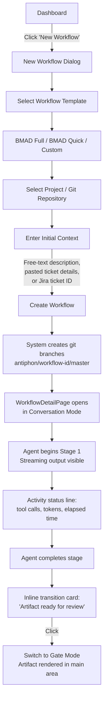
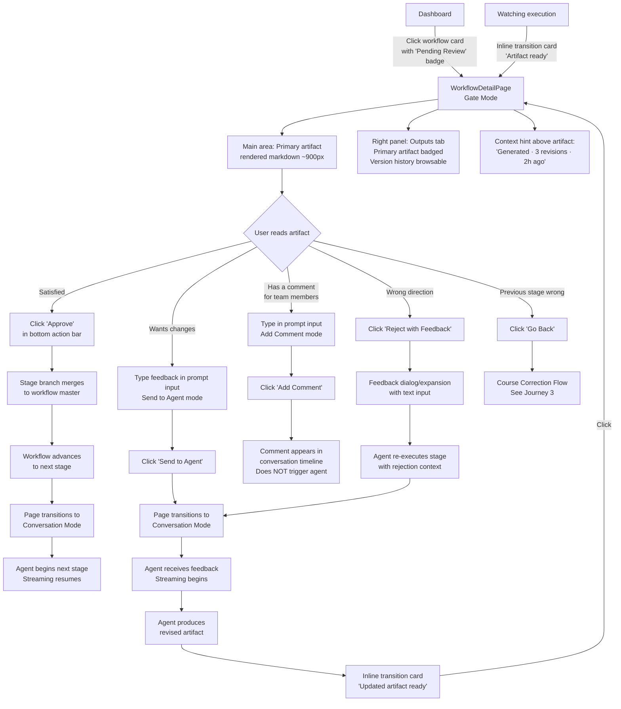
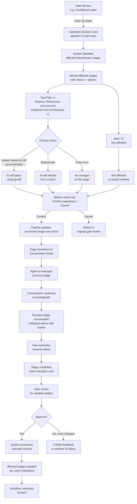
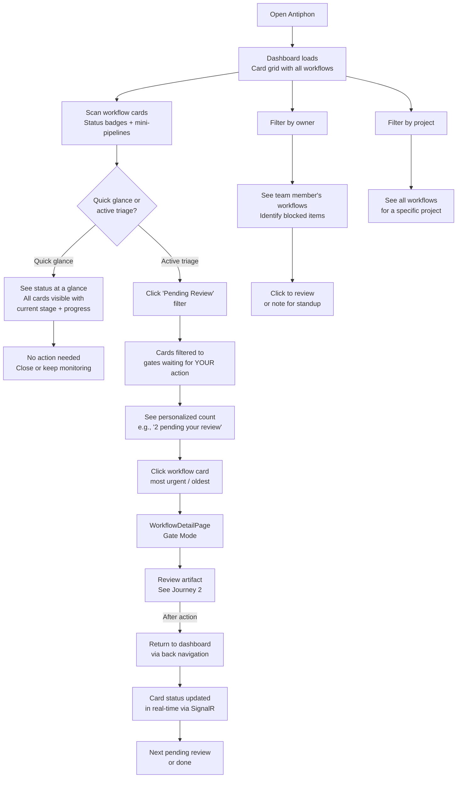

## User Journey Flows

### Journey 1: New Workflow Creation

**Actor:** Developer (Mike)
**Goal:** Create a new workflow from a feature description and have the AI start generating the first artifact.
**Entry point:** Dashboard → "New Workflow" button

**Key UX decisions:**
- New Workflow dialog, not a full page — keeps the user in dashboard context
- Template selection as a simple list with descriptions, not a complex wizard. Templates managed in Settings page (add/edit/delete YAML workflow definitions).
- Initial context is a single free-text field — no structured form. The AI figures out what it needs from the input.
- Workflow creation is immediate — no "processing" screen. The page navigates to WorkflowDetailPage and streaming begins.
- First-time delight: user types a description and within seconds sees the AI reading their codebase and drafting a spec.
- **Separate session support:** Workflow creation and first review may happen in separate sessions. If the user leaves and returns later, they re-enter via the dashboard (Journey 4 pattern) — the workflow card shows "Pending Review" if the agent finished, or "AI Working" if still running.

**Error paths:**
- Invalid git repository → inline error in dialog, field highlighted
- Template not found → shouldn't happen (bundled), but show clear error with "contact admin"
- Agent fails to start → WorkflowDetailPage shows error state with "Retry" button

---

### Journey 2: Gate Review & Approval

**Actor:** Developer (Mike) or Team Lead (Sarah)
**Goal:** Review an AI-generated artifact at a gate checkpoint and take action (approve, reject, provide feedback, or leave a comment).
**Entry points:** Dashboard card click (pending review) OR inline transition card after watching execution

**Key UX decisions:**
- Arriving at a gate always lands in Gate Mode with artifact front and center
- Three distinct gate actions with distinct colors: Approve (green), Reject (yellow), Go Back (orange) — no ambiguity
- **Dual-mode prompt bar:** Toggle or dropdown on the send button switches between "Send to Agent" (triggers re-execution) and "Add Comment" (leaves a note for human collaborators, does NOT trigger the agent). Enables team discussion about artifacts without the AI jumping in.
- Prompt input (Send to Agent) vs. Reject are different flows: Send is "refine this," Reject is "this approach is wrong, start over with this context"
- Version badge on artifact (v1, v2) so reviewer knows if this is fresh or revised
- **Version history browsable** in Outputs tab — users can view and compare previous artifact versions. If a revision is worse, they can prompt the agent "restore v1"
- Conversation tab in right panel gives context for reviewers who didn't watch execution

**Error paths:**
- Approval fails (git merge conflict) → error banner with "Retry" or "View conflict details"
- Agent fails during re-execution → conversation shows error, "Retry from checkpoint" button

---

### Journey 3: Course Correction (Go Back)

**Actor:** Developer (Mike)
**Goal:** Correct a mistake in a previous stage by going back, triggering intelligent cascade updates on affected downstream stages.
**Entry point:** Gate review → "Go Back" button

**Key UX decisions:**
- Cascade decision card is an inline UI in the main area — prominent, not hidden in a panel
- **Each affected stage shows the REASON it's affected** — e.g., "Test Plan v1 references microservice endpoints from Architecture v1." Users make informed choices, not blind ones.
- Each affected stage shows: stage name, current version, reason for impact, and three action buttons
- "Update based on diff" is the default/recommended option — highlighted or pre-selected
- Preview of what will change is available before confirming (expandable diff preview per stage)
- Cancel is always available — no commitment until "Confirm selections" is clicked
- After confirmation, the conversation timeline continues chronologically — the go-back and its context are part of the workflow's story
- Stage markers in the conversation show the version history: "Architecture (v1) — rejected" → "Architecture (v2) — current"

**Error paths:**
- Diff-based update produces poor results → user can reject at the next gate and choose "Regenerate from scratch" instead
- Go back to a stage that has no downstream dependents → no cascade card needed, just re-execute the stage directly
- Multiple go-backs in sequence → each one adds to the chronological conversation, all versions tracked

---

### Journey 4: Dashboard Triage (Team Lead)

**Actor:** Team Lead (Sarah)
**Goal:** Get a quick picture of all in-flight workflows, identify what needs her attention, and act on pending reviews.
**Entry point:** Opening Antiphon dashboard

**Key UX decisions:**
- Dashboard loads fast (<2s) and shows all workflows immediately — no loading spinners for the card grid
- Card border-left color is the primary visual signal: blue (AI working), orange (needs review), green (done), red (failed)
- "Pending Review" filter is personalized — only shows gates waiting for the logged-in user's action (post-MVP with auth; MVP shows all pending since single user)
- Mini-pipeline on each card gives instant stage progress without clicking
- Real-time updates via SignalR — when Sarah approves a gate in WorkflowDetailPage and returns to the dashboard, the card has already updated
- No page reload needed — ever. Dashboard is a live view.
- Filter combinations: status + owner + project for team leads who need cross-cutting views
- **Add Comment (not just agent feedback)** — Sarah can leave comments for the workflow creator at gates without triggering the agent. Enables team discussion about artifacts.

**Error paths:**
- Dashboard fails to load → standard error page with retry
- SignalR disconnection → reconnection with stale indicator ("Last updated 30s ago · Reconnecting...")
- No workflows exist → empty state with "Create your first workflow" call to action

---

### Journey Patterns

**Common patterns extracted across all four journeys:**

**Navigation Patterns:**
- **Card → Detail → Back** — Dashboard card click navigates to WorkflowDetailPage. Back button returns to dashboard with live-updated cards. No deep navigation beyond two levels.
- **Mode transition via inline cards** — State changes (stage complete, cascade decision) appear as inline cards in the conversation flow, not as modals or navigation events. The user clicks to transition.
- **Right panel as context navigator** — Outputs tab serves as artifact navigation (with version history). Stage Info tab serves as pipeline navigation. Conversation tab serves as history navigation. All in the same panel.
- **Settings for admin functions** — Template management (add/edit/delete YAML workflow definitions), LLM provider configuration, and project setup live under Settings in the navbar.

**Decision Patterns:**
- **Three distinct gate actions** — Approve (green), Reject with Feedback (yellow), Go Back (orange). Always in the bottom action bar. Always visible at gate checkpoints. No ambiguity about what each does.
- **Cascade decisions as inline UI** — Course correction choices (update/regenerate/keep) appear in the main area as a decision card, not as a modal or dialog. Each affected stage includes the REASON it's affected. Confirm/Cancel in the bottom action bar.
- **Default recommendations** — "Update based on diff" is pre-selected as the recommended option. Reduces cognitive load while preserving user choice.

**Feedback Patterns:**
- **Dual-mode prompt bar** — Bottom action bar prompt input supports two modes: "Send to Agent" (triggers re-execution) and "Add Comment" (leaves a note for human collaborators, does NOT trigger the agent). Toggle or dropdown on the send button.
- **Comment styling in conversation timeline** — Human-to-human comments are visually distinct from agent prompts. Different background, icon, or label so the conversation history clearly shows "this was for the agent" vs "this was a note between team members."
- **Immediate response visibility** — After sending feedback to the agent, page transitions to conversation mode and the agent's response streams immediately. No void, no "processing" spinner. Comments appear instantly without mode transition.
- **Conversation as complete history** — All feedback, comments, agent responses, and gate decisions live in the chronological conversation timeline. Nothing is lost.

**Status Patterns:**
- **Real-time everywhere** — Dashboard cards, stage pipelines, activity status lines, and conversation streams all update via SignalR. No manual refresh anywhere in the app.
- **Motion for active, color for state** — Pulsing/animated indicators for "agent is working." Static color badges for completed states (green/orange/red). Never confuse "active" with "clickable."
- **Progressive detail** — Card shows status badge + mini-pipeline. WorkflowDetailPage shows full pipeline + streaming. Audit tab shows token-level detail. Each level adds depth.

### Flow Optimization Principles

1. **Minimize clicks to value** — Dashboard to reviewing an artifact is 1 click (card click → gate mode). Creating a workflow to seeing the first output is 3 clicks (New → template → context → go).
2. **Never lose context** — Conversation history is always accessible. Scroll position preserved across mode transitions. Stage markers let users trace back to any point in the workflow's history.
3. **Errors are recoverable inline** — No error pages. Errors appear as conversation events or inline banners with clear next actions (retry, view details, go back).
4. **Real-time by default** — Every state change pushes to connected clients. Users never wonder "is this current?" because it always is.
5. **One primary action per screen** — Gate mode: the primary action is Approve. Conversation mode: the primary action is watching/waiting. Dashboard: the primary action is clicking the most urgent card. No competing calls to action.
6. **Two types of feedback, clearly distinguished** — "Send to Agent" triggers AI work. "Add Comment" enables team discussion. Both live in the same prompt bar, clearly toggled. Both appear in the conversation timeline with distinct styling.
