# UI screenshots

Generated by `npm run screenshots` (client/scripts/storybook-screenshots.mjs) from Storybook
stories whose data comes from the backend-contract fixtures
(`client/src/test/fixtures/contract/`, captured by `ContractSnapshotTests`).
Regenerate after UI changes and review the image diff — a drastic rendering break shows up
here before anyone opens the app.

## Agents/DirectoryAutocomplete — Empty Shows Drives

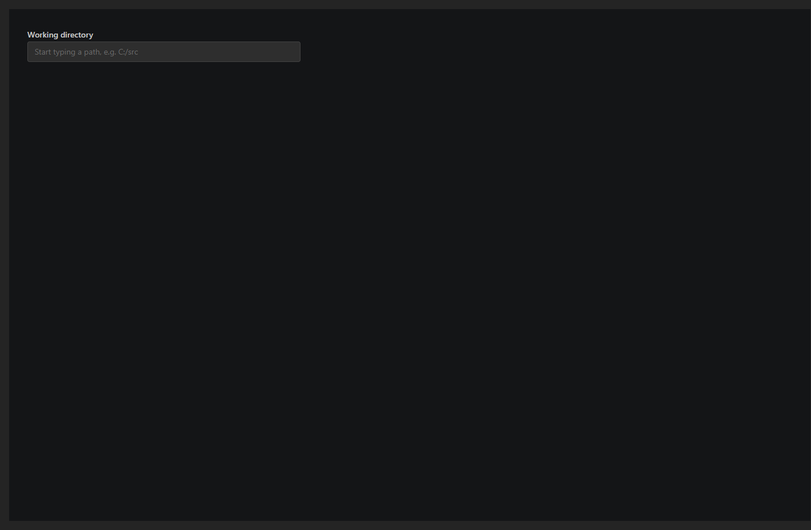

## Agents/DirectoryAutocomplete — Prefix Shows Children

## Agents/DirectoryAutocomplete — Missing Path Shows Warning And Toggle

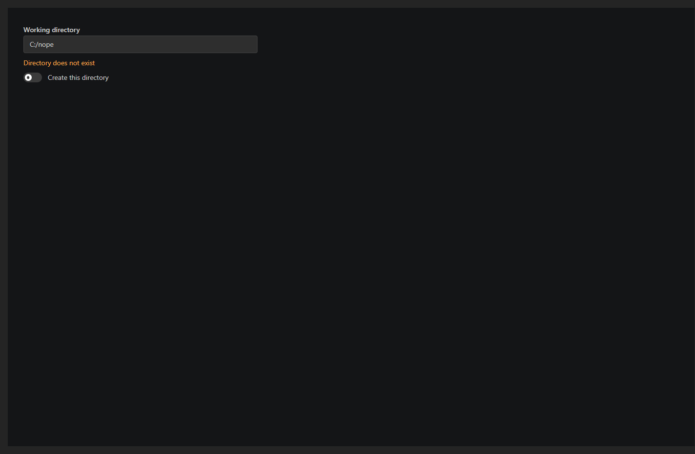

## Agents/DirectoryAutocomplete — Existing Path No Warning

## Agents/FilesReviewPanel — Tree

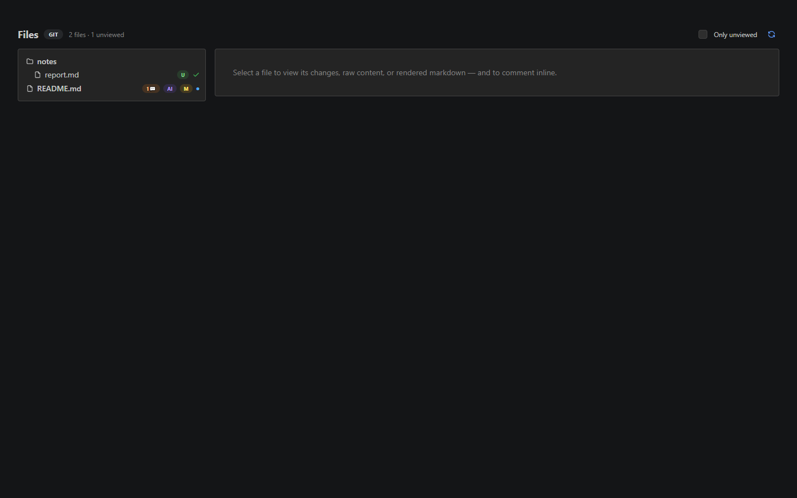

## Agents/FilesReviewPanel — Diff With Answered Thread

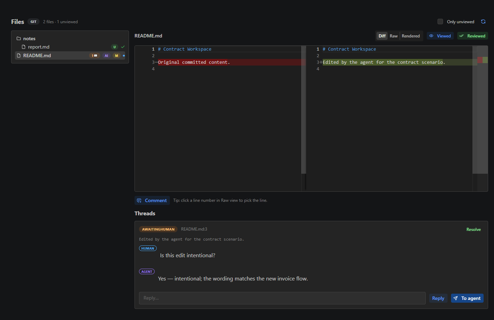

## Agents/FilesReviewPanel — Diff No Threads

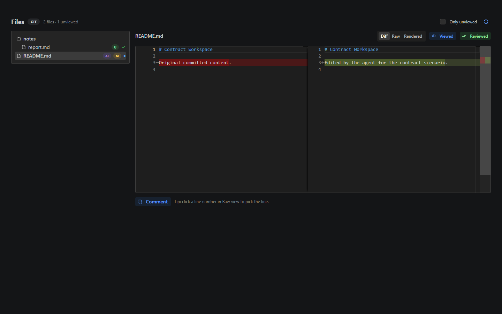

## Agents/SessionTranscriptPanel — Conversation

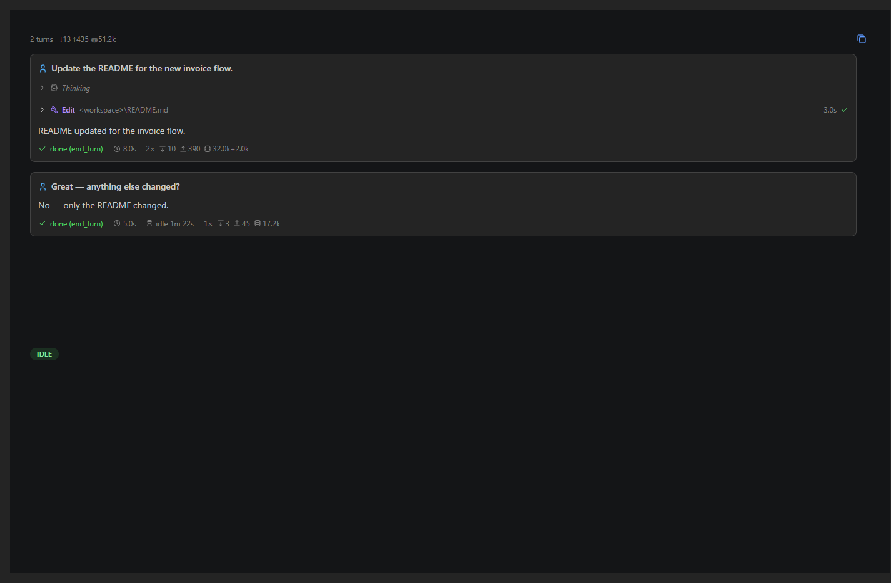

## Agents/SessionTranscriptPanel — With Composer

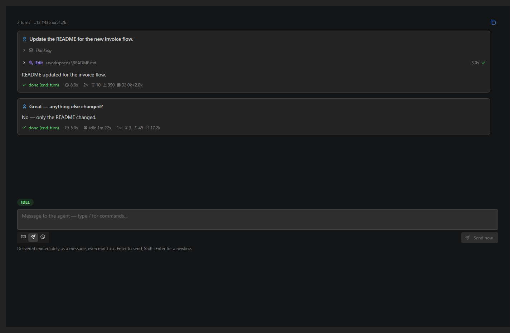

## Pages/Home (Workflows) — Desktop

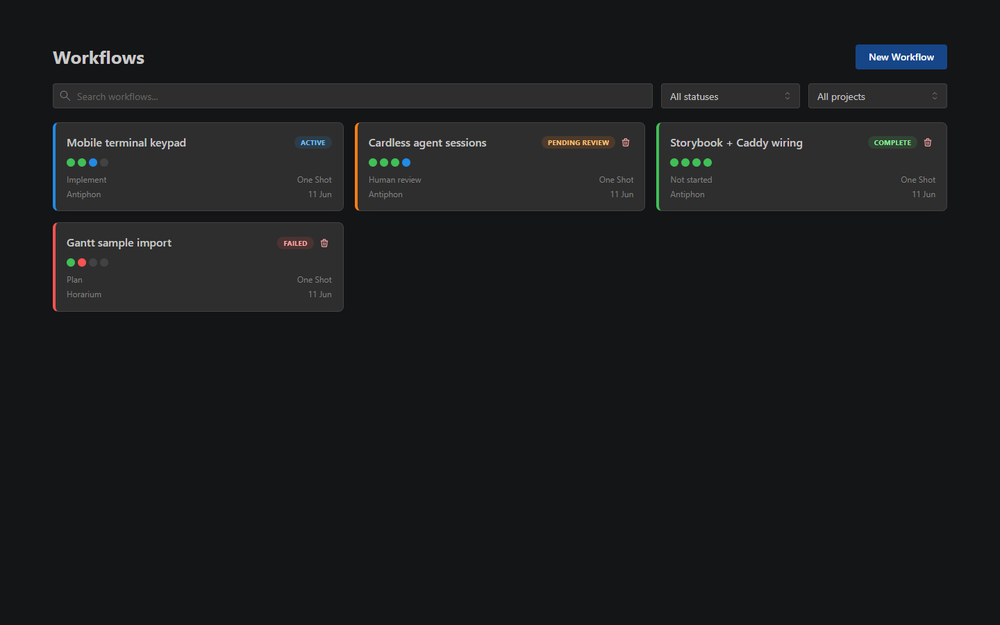

## Pages/Home (Workflows) — Mobile

## Dashboard/NewWorkflowDialog/SubmitButton — Broken

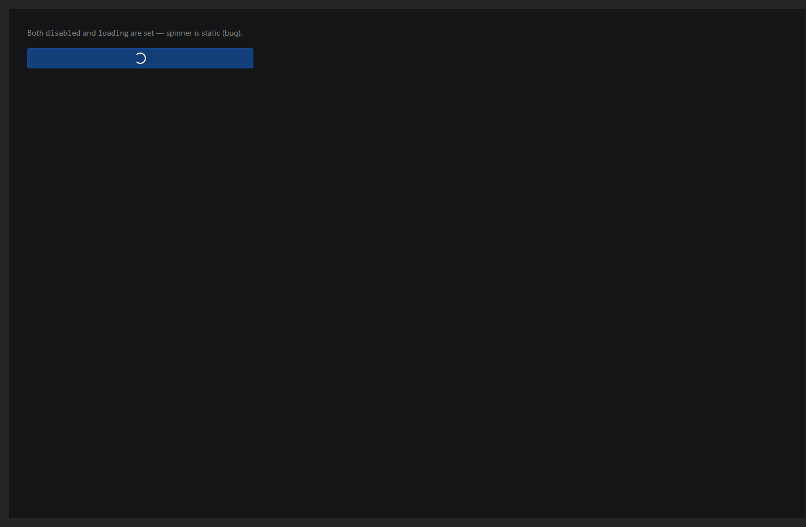

## Dashboard/NewWorkflowDialog/SubmitButton — Fixed

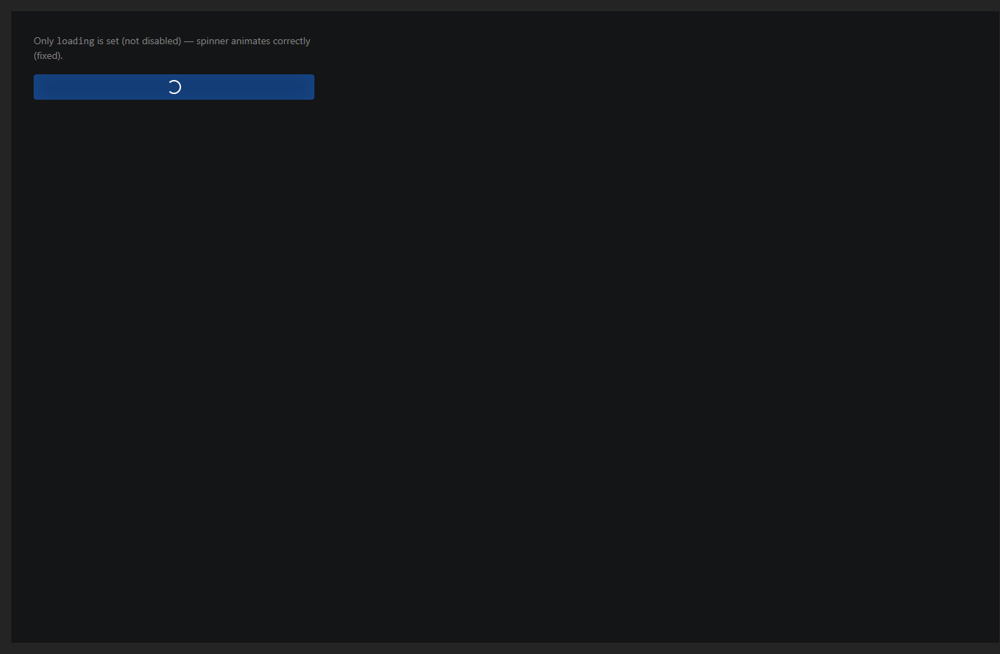

## Delegations/Board — Board

## Delegations/Board — Drawer

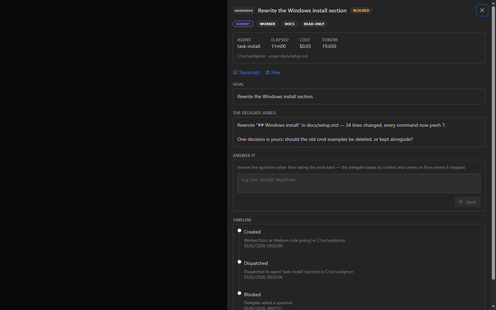

## Delegations/Board — Delegate

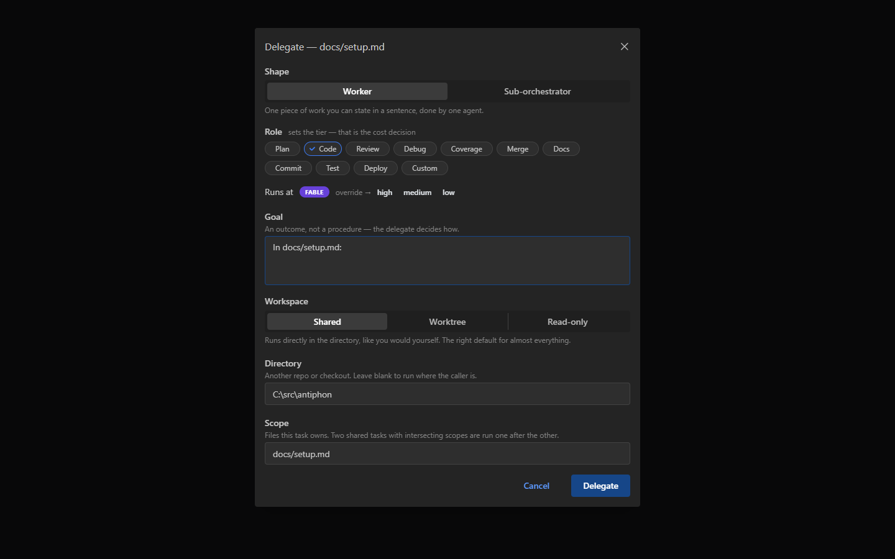
