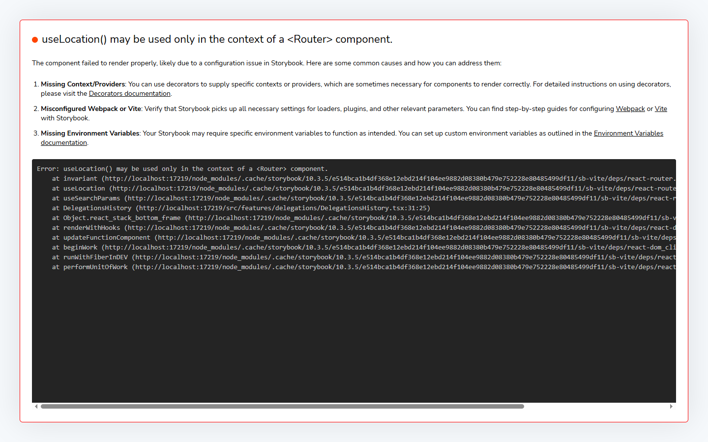
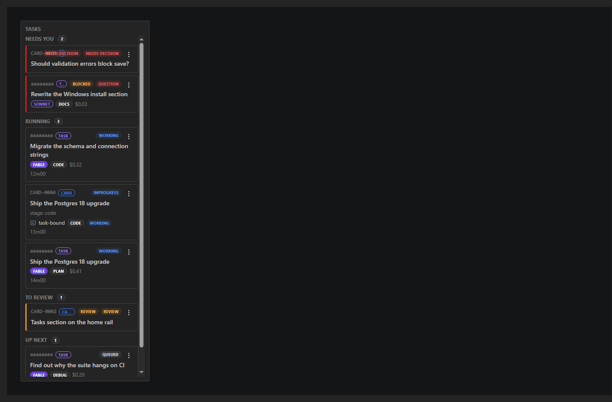
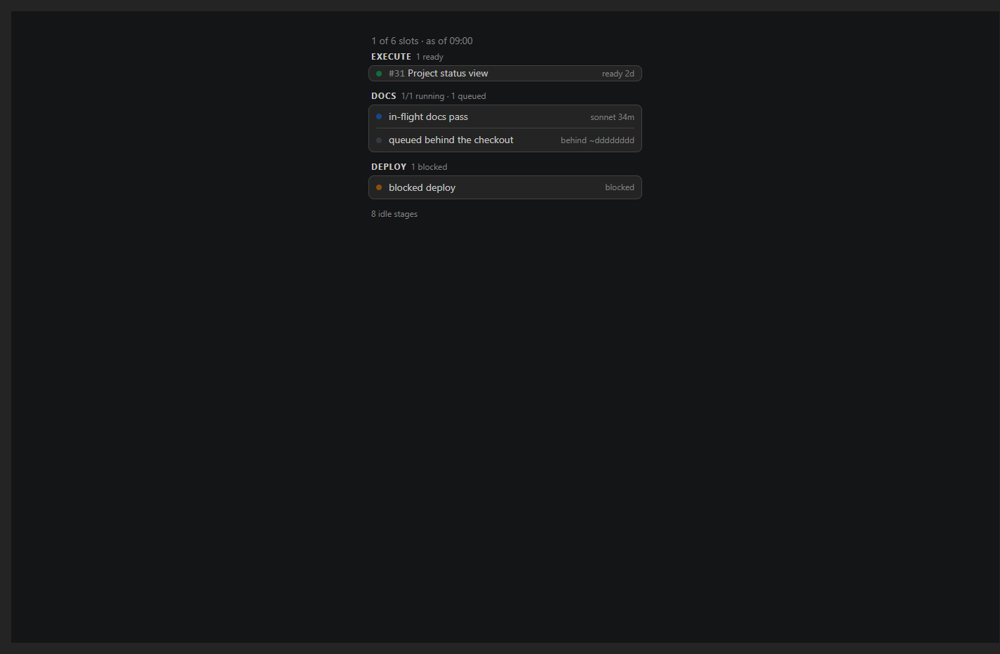
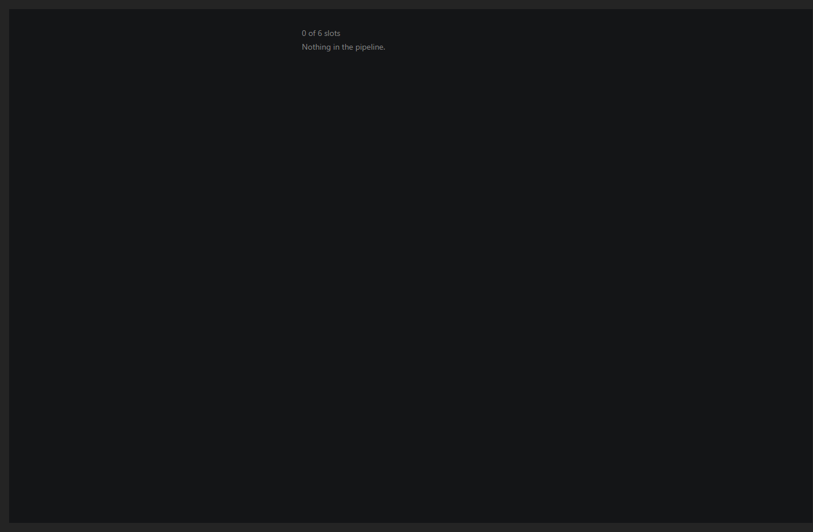
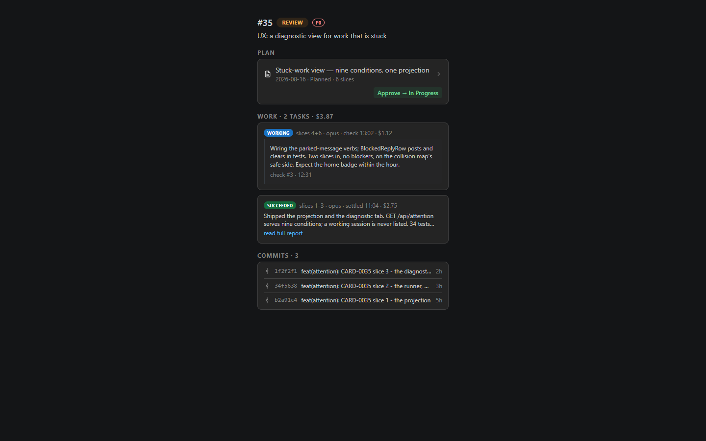
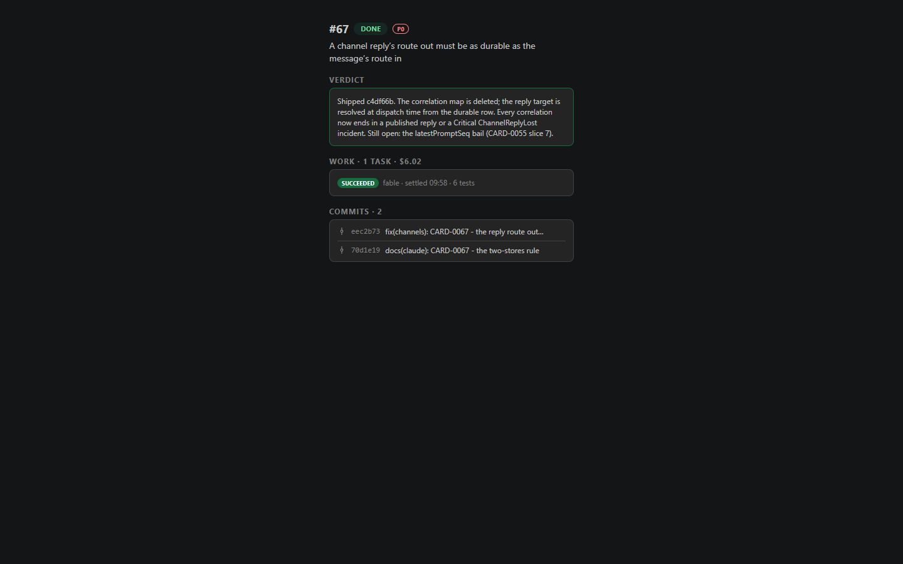
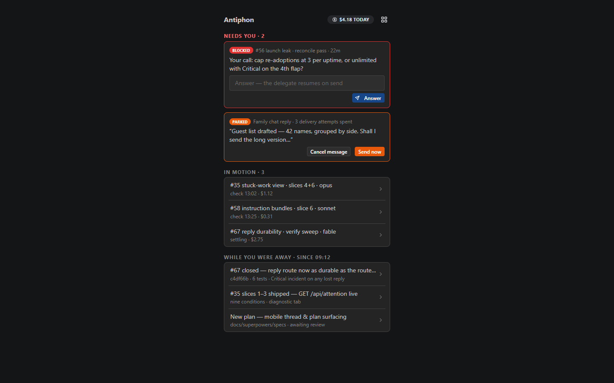
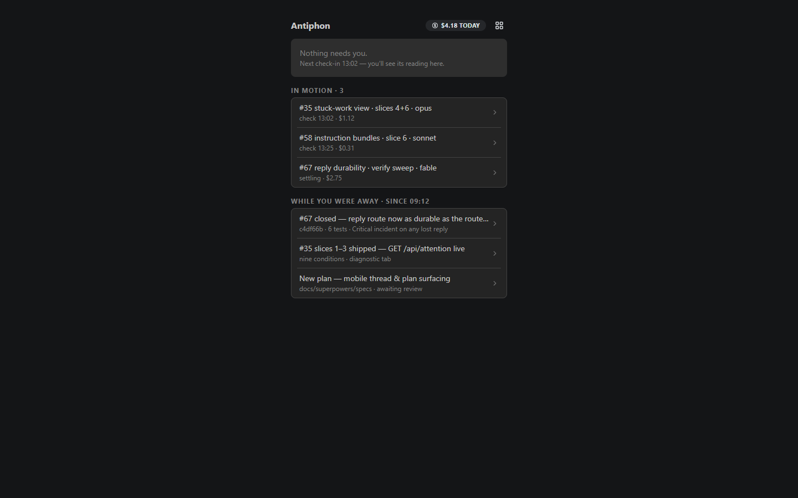
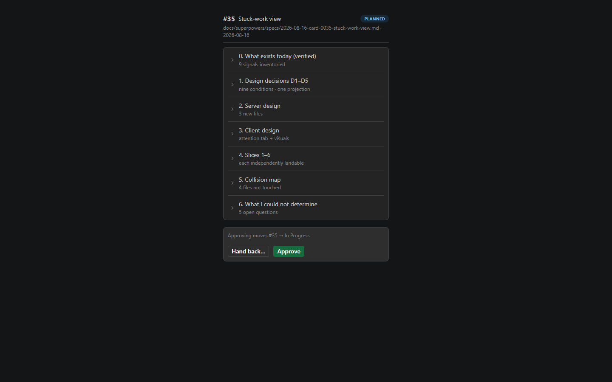
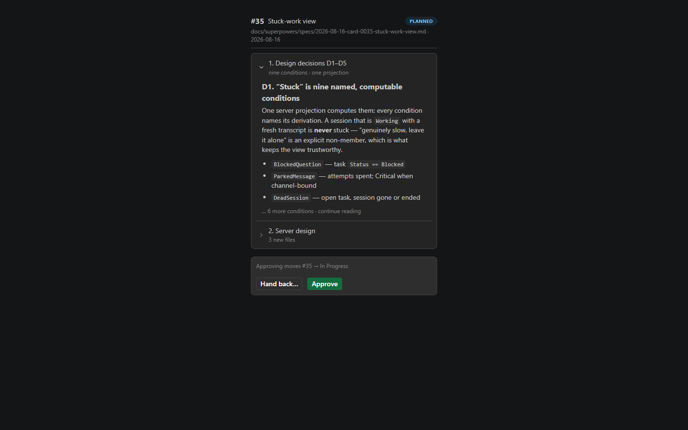

# UI screenshots

Generated by `npm run screenshots` (client/scripts/storybook-screenshots.mjs) from Storybook
stories whose data comes from the backend-contract fixtures
(`client/src/test/fixtures/contract/`, captured by `ContractSnapshotTests`).
Regenerate after UI changes and review the image diff — a drastic rendering break shows up
here before anyone opens the app.

## Agents/DirectoryAutocomplete — Empty Shows Drives

## Agents/DirectoryAutocomplete — Prefix Shows Children

## Agents/DirectoryAutocomplete — Missing Path Shows Warning And Toggle

## Agents/DirectoryAutocomplete — Existing Path No Warning

## Agents/FilesReviewPanel — Tree

## Agents/FilesReviewPanel — Diff With Answered Thread

## Agents/FilesReviewPanel — Diff No Threads

## Agents/HerdrStatusBadge — States

## Agents/HerdrStatusBadge — Disagreement

## Agents/SessionTranscriptPanel — Conversation

## Agents/SessionTranscriptPanel — With Composer

## Pages/Home (Workflows) — Desktop

## Pages/Home (Workflows) — Mobile

## Dashboard/NewWorkflowDialog/SubmitButton — Broken

## Dashboard/NewWorkflowDialog/SubmitButton — Fixed

## Delegations/Board — Board

## Delegations/Board — Drawer

## Delegations/Board — Delegate

## Delegations/Board — History

## Delegations/History — History

## Home/TasksSection — Rail

## Orchestrator/Pipeline stages — Live

## Orchestrator/Pipeline stages — Calm

## Proposals/Card thread — Open

## Proposals/Card thread — Settled

## Proposals/Mobile home — Needs You

## Proposals/Mobile home — Calm

## Proposals/Plan reader — ToC first

## Proposals/Plan reader — Section open

